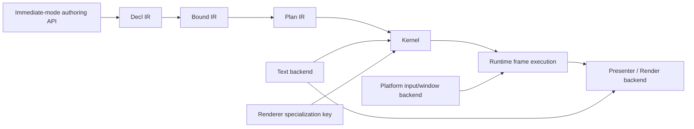
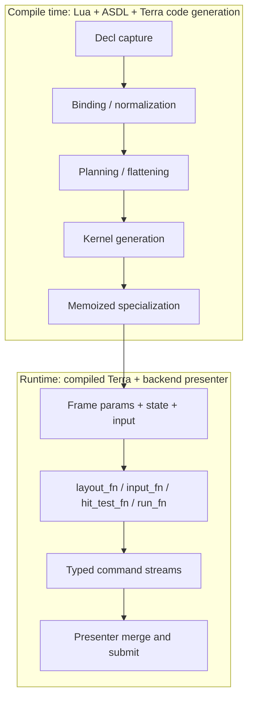

# TerraUI Design Overview

Status: draft v0.2  
Source basis: extracted from the latest design revisions in `starter-conv.txt`.

This file is the entry point for the TerraUI design set.

## Design set

- `docs/design/00-overview.md` — product thesis, system shape, major decisions
- `docs/design/01-ir-and-pipeline.md` — compiler IR, phases, invariants, specialization
- `docs/design/02-layout-input-and-rendering.md` — Clay-like layout, clipping, floating, hit testing, draw ordering
- `docs/design/03-runtime-backends-opengl.md` — runtime types and the current OpenGL 3.3 example backend path
- `docs/design/04-prototype-and-open-questions.md` — v1 vertical slice, demo target, unresolved questions
- `docs/design/05-full-asdl-spec.md` — full compiler-facing ASDL specification
- `docs/design/06-validation-rules.md` — schema, lowering, and backend validation rules
- `docs/design/07-method-contracts.md` — semantic contracts for all ASDL-declared methods
- `docs/design/08-context-contracts.md` — contracts for BindCtx, PlanCtx, and CompileCtx
- `docs/design/09-authoring-api.md` — public immediate-mode builder API and lowering rules
- `docs/design/10-builder-api-reference.md` — concrete builder functions, option tables, and signatures
- `docs/design/11-schema-dsl.md` — Terra language-extension schema DSL for authoring and validating the ASDL
- `docs/design/12-backend-contracts.md` — backend identity, runtime session, and presenter/backend contract
- `docs/design/terraui.asdl` — canonical raw ASDL schema

Recommended implementation reading order:
1. `01-ir-and-pipeline.md`
2. `05-full-asdl-spec.md`
3. `docs/design/terraui.asdl`
4. `06-validation-rules.md`
5. `07-method-contracts.md`
6. `08-context-contracts.md`
7. `09-authoring-api.md`
8. `10-builder-api-reference.md`
9. `11-schema-dsl.md`
10. `02-layout-input-and-rendering.md`
11. `03-runtime-backends-opengl.md`
12. `12-backend-contracts.md`
13. `04-prototype-and-open-questions.md`

## 1. Product definition

TerraUI is a compiler-backed immediate-mode UI library for Terra.

Its central promise is:

> UI remains immediate and ergonomic at authoring time, while layout, bindings, hit testing, and draw emission are compiled into specialized native code for the exact UI structure being used.

TerraUI is **not** a retained scene graph, and it is **not** intended to be a generic runtime widget object system.

## 2. Final architectural direction

The final conversation revisions converge on these decisions:

1. The pipeline is:
   **Decl -> Bound -> Plan -> Kernel**
2. `Bound` replaces the earlier looser `Norm` naming.
3. `Clip` is first-class and replaces the earlier overflow/scroll smear.
4. `aspect_ratio` belongs on the node itself, not only on image leaves.
5. The `Plan` phase flattens the tree into a dense node array plus typed side tables.
6. The `Kernel` phase should remain record-only and as monomorphic as possible.
7. Rendering stays split by command stream.
8. Correct cross-stream draw order is preserved with a per-command `seq` field plus merge on `(z, seq)`.
9. Text remains high-level in the kernel and is shaped later by the presenter/font backend.
10. The first real proof target is a small editor/inspector UI vertical slice.

## 3. System context

## 4. Compile-time vs runtime boundary

## 5. Top-level principles

### 5.1 Fixed pipeline

TerraUI should expose one canonical compilation path, not a generic meta-framework.

### 5.2 Generic node record

The UI tree should be modeled as one generic node record with optional features, rather than a large runtime node union.

### 5.3 Flatten before codegen

The tree may survive through `Bound`, but `Plan` must flatten aggressively to produce codegen-friendly data.

### 5.4 Compile structural decisions early

Anything structural should be decided before runtime:
- layout strategy
- node structure
- leaf specialization
- binding shape
- float target resolution
- runtime type layout

### 5.5 Split command streams

Do not collapse draw commands into one tagged union. Keep separate streams and recover order with `(z, seq)` merging.

## 6. V1 scope

### Included
- row / column layout
- stack-like authoring sugar if it lowers cleanly
- fit / grow / fixed / percent sizing
- padding, gap, alignment
- clipping and scroll offsets
- floating overlays / tooltip placement
- text, image, custom leaves
- background, border, radius, opacity
- hover / active / focus / wheel interaction
- OpenGL 3.3 renderer backend
- simple font backend contract

### Excluded for now
- browser-grade layout
- rich text shaping as part of kernel generation
- docking systems
- accessibility system
- generalized reactive runtime
- CSS-like styling engine

## 7. Why this design fits Terra

TerraUI leans directly on the Terra compiler pattern already captured in this repo:
- ASDL types model the domain
- methods on ASDL nodes perform lowering
- Terra struct metamethods synthesize layouts and helper methods
- `terralib.memoize` caches specialization outputs
- the final runtime artifact is narrow and concrete

## 8. Key correctness constraints

1. Same input tree + same specialization key = same compiled kernel.
2. `Kernel` should avoid sum types where possible.
3. Clip begin/end must bracket the entire subtree, not only node-local paint.
4. Cross-stream draw ordering must be preserved globally.
5. Hit testing must respect ancestor clipping.
6. Text shaping should stay outside the kernel for v1.

## 9. Recommended reading order

1. `01-ir-and-pipeline.md`
2. `02-layout-input-and-rendering.md`
3. `03-runtime-backends-opengl.md`
4. `04-prototype-and-open-questions.md`
