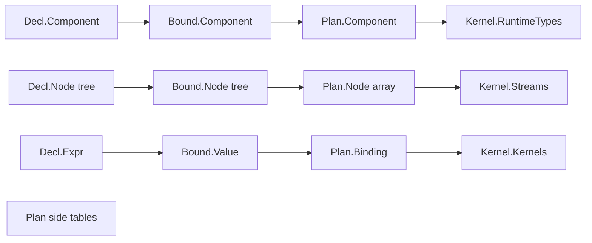
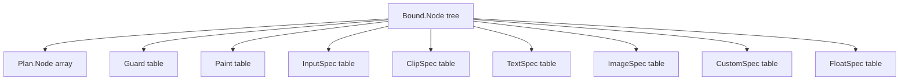
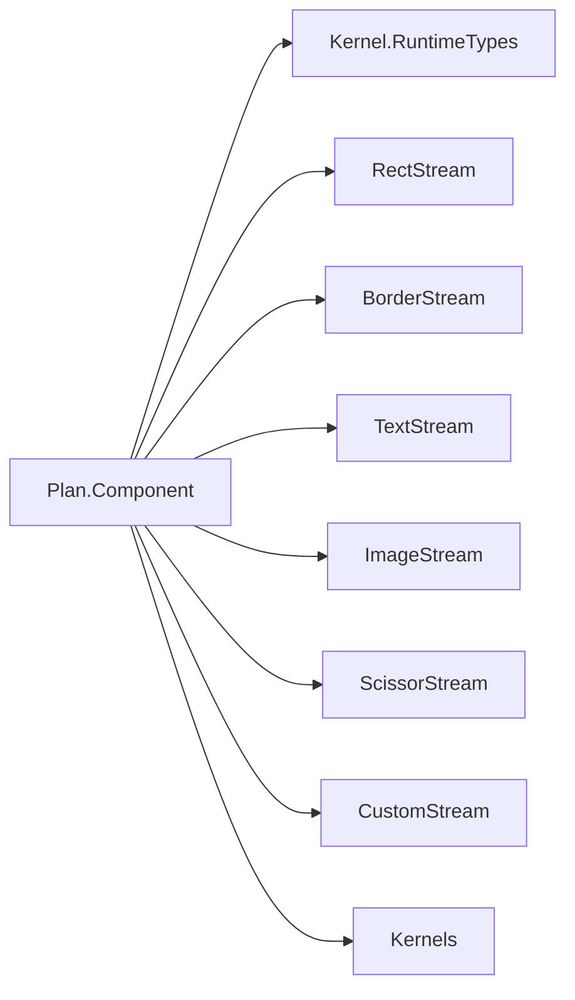
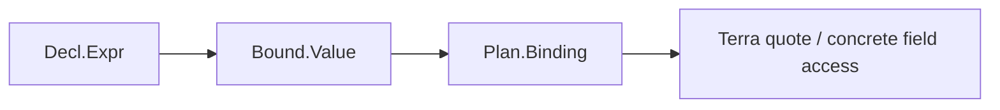

# TerraUI IR and Compilation Pipeline

Status: draft v0.2  
Source basis: final revised schema and lowering notes from `starter-conv.txt`.

## 1. Pipeline summary

TerraUI uses four phases:

```text
Decl -> Bound -> Plan -> Kernel
```

This is the final intended naming.

Earlier discussion used `Norm`, but the later revisions settled on `Bound` because this phase does more than normalize: it resolves names, slots, ids, and intrinsic bindings.

## 2. Phase responsibilities

| Phase | Purpose | Shape | Main complexity |
|---|---|---|---|
| Decl | authored UI description | tree | rich syntax, sugar, leaf/value unions |
| Bound | resolved and classified tree | tree | slot binding, constant folding, stable ids |
| Plan | explicit flattened runtime plan | flat arrays + side tables | layout/input/paint data, final binding carrier |
| Kernel | compiled runtime artifact | records + Terra functions | no tree unions, backend-specific structs |

## 3. Phase diagram



## 4. Decl phase

`Decl` is the author-facing representation.

### 4.1 Main types

- `Decl.Component`
- `Decl.Param`
- `Decl.StateSlot`
- `Decl.WidgetDef`
- `Decl.WidgetCall`
- `Decl.Node`
- `Decl.Child`
- `Decl.Layout`
- `Decl.Decor`
- `Decl.Clip`
- `Decl.Floating`
- `Decl.Input`
- `Decl.Leaf = Text | Image | Custom`
- `Decl.Expr`

### 4.2 Final important shape choices

#### Generic node record

The node is one structural record containing:
- id
- visibility
- layout
- decor
- optional clip
- optional floating placement
- input behavior
- optional aspect ratio
- optional leaf payload
- child list

This avoids infecting the entire tree with a giant node-kind union.

#### Clip is first-class

Later revisions replaced the older `Overflow` model with explicit `Clip`:
- `horizontal`
- `vertical`
- optional `child_offset_x`
- optional `child_offset_y`

This models clipping and scrolling as a structural feature of the node.

#### Aspect ratio is node-level

`aspect_ratio` is on the node itself, not just on image leaves. That lets any node participate in aspect-constrained sizing.

## 5. Bound phase

`Bound` resolves authoring sugar into canonical meaning.

### 5.1 Responsibilities

- map params to slot indices
- map state to slot indices
- register widget definitions
- elaborate widget calls and slot placeholders away
- resolve theme refs and env refs
- resolve intrinsic function names
- normalize ids into stable ids
- narrow expressions to `Bound.Value`
- preserve canonical tree shape while removing authoring-only ambiguity

### 5.2 Main value forms

`Bound.Value` still allows a small union, but it is already much narrower than `Decl.Expr`:
- constant bool/number/string/color/vec2
- param slot
- state slot
- env slot
- unary / binary / select
- intrinsic(fn, args)

### 5.3 Specialization key

The final conversation uses a specialization key at this stage:
- renderer
- text backend
- bound root tree

This is wrapped in `unique` ASDL identity and is intended to feed `terralib.memoize`.

## 6. Plan phase

`Plan` is the flattened, codegen-facing plan.

### 6.1 Why Plan exists

This is where TerraUI stops thinking in terms of an authored tree and starts thinking in terms of compiled execution data.

### 6.2 Main types

- `Plan.Component`
- `Plan.Node`
- `Plan.Guard`
- `Plan.Paint`
- `Plan.InputSpec`
- `Plan.ClipSpec`
- `Plan.TextSpec`
- `Plan.ImageSpec`
- `Plan.CustomSpec`
- `Plan.FloatSpec`
- `Plan.Binding`

### 6.3 Flattened side-table design



This is one of the most important design decisions in the whole system.

`Plan.Node` is not a tagged union. Node special cases move into typed side tables and are referred to by slot indices.

### 6.4 Plan.Node fields that matter most

Final discussion settled on `Plan.Node` including at least:
- `index`
- `parent`
- `first_child`
- `child_count`
- `subtree_end` for subtree bracketing
- axis, width rule, height rule
- padding and gap bindings
- alignment
- slots for guard, paint, input, clip, text, image, custom, float
- `has_aspect_ratio`
- optional `aspect_ratio` binding

### 6.5 Why `subtree_end` was added

The OpenGL/backend revision discovered a correctness issue:
- clip begin/end cannot be emitted only inside paint for one node
- clipping must remain active over descendants

So `Plan.Node` needs a preorder subtree range:
- descendants of node live in `[index + 1, subtree_end)`
- this allows subtree-scoped clip begin/end handling

## 7. Kernel phase

`Kernel` is the compiled output.

### 7.1 Goal

The final phase should be record-only or as close as possible.

### 7.2 Main contents

- runtime Terra types
- typed command stream types
- compiled Terra functions: `init_fn`, `layout_fn`, `input_fn`, `hit_test_fn`, `run_fn`

### 7.3 Kernel output structure



## 8. Binding evolution

Bindings narrow across phases:



### 8.1 Decl.Expr
Rich authoring syntax.

### 8.2 Bound.Value
Resolved and partially folded.

### 8.3 Plan.Binding
Last union-heavy value carrier before code generation.

### 8.4 Terra quote
Backend-specific concrete code.

## 9. Memoization and specialization

Compilation is intended to use `terralib.memoize` over structurally unique keys.

### 9.1 Intended contract

```text
same Bound/Plan structure + same renderer + same text backend
=> same compiled kernel object
```

### 9.2 Why it matters

- avoids recompiling identical components
- makes specialization deterministic
- turns structural identity into an explicit API property

## 10. Core invariants

### 10.1 Phase invariants

| Invariant | Meaning |
|---|---|
| Decl may be rich | authoring sugar is allowed |
| Bound is canonical | equivalent authored forms should converge |
| Plan is flat | tree shape is no longer primary |
| Kernel is narrow | runtime should not interpret unions |

### 10.2 Structural invariants

1. Every `Bound.Node` has a resolved stable id.
2. Every `Plan.Node` owns slot references into side tables instead of embedding variant payloads.
3. Clip regions are represented by `ClipSpec`, not scattered booleans.
4. Node aspect ratio is expressed uniformly regardless of leaf kind.
5. A node subtree has a stable preorder interval for clip bracketing.

## 11. Methods that define the system

The design repeatedly points to five central lowering/codegen methods:
- `Decl.Expr:bind(ctx)`
- `Decl.Node:bind(ctx)`
- `Bound.Value:plan_binding(ctx)`
- `Bound.Node:plan(ctx)`
- `Plan.Component:compile(ctx)`

These are effectively the architectural spine of TerraUI.

## 12. What changed from the earlier draft

The initial root architecture draft in this repository used an earlier intermediate design. The final conversation revisions changed the source of truth in these ways:

1. `Norm` -> `Bound`
2. `Overflow` -> `Clip`
3. node-level `aspect_ratio`
4. explicit `ClipSpec` table in `Plan`
5. `subtree_end` for subtree-scoped clipping correctness
6. per-command `seq` and frame `draw_seq` for global ordering correctness

Those changes should be treated as authoritative for future implementation.
