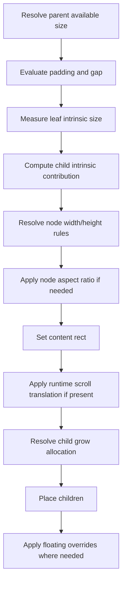
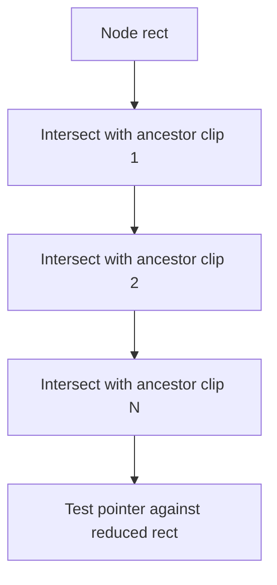
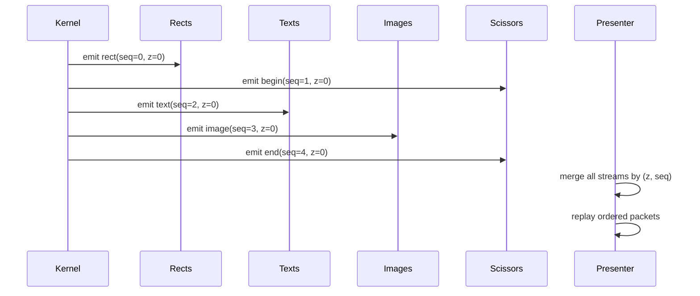
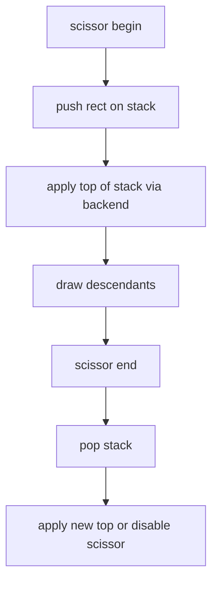
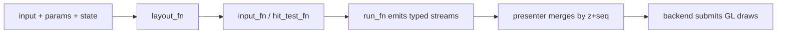

# TerraUI Layout, Input, and Rendering Semantics

Status: draft v0.3  
Source basis: final layout/codegen revisions in `starter-conv.txt`.

Implementation note: the canonical design now separates structural clip from runtime-backed scroll. The current implementation still uses the older clip-plus-offset model until migrated.

## 1. Purpose

This document defines the execution semantics that sit between the IR and the backend:
- layout behavior
- clipping and scrolling behavior
- floating placement
- hit testing
- render command emission and ordering

For the next design layer, theme tokens and style patches are still authored above these semantics. They should be elaborated into ordinary decor/text/image values before this document’s runtime rules apply.

## 2. Layout model

The intended layout model is Clay-like:
- box/tree based
- row/column axis
- fit/grow/fixed/percent sizing
- padding and gap
- x/y alignment
- measured text leaves
- aspect-ratio constrained nodes
- clip and scroll-area behavior
- floating attachment points

## 3. Layout pass structure

The discussion converges on a multi-step node layout process.

## 4. Size rules

### 4.1 Fit

Size from intrinsic content, then clamp by optional min/max.

### 4.2 Grow

Consume remaining available space on the main axis, again respecting optional min/max.

### 4.3 Fixed

Use an explicit numeric value.

### 4.4 Percent

Use a fraction of the available size.

## 5. Intrinsic size sources

A node’s intrinsic size comes from the max of:
- leaf intrinsic size
- aggregate child intrinsic contribution

Then padding is added.

### 5.1 Text leaf

Text measurement is the main measured intrinsic input.

For wrapped text, TerraUI treats measurement as a height-for-width problem:
- intrinsic width is measured as max-content width
- wrapped height is remeasured after a concrete content width is known
- the resulting height then propagates back into fit-height container layout

### 5.2 Image leaf

Image size may interact with node `aspect_ratio`.

### 5.3 Custom leaf

Custom leaves can still occupy a regular content box even if actual rendering is backend-specific.

## 6. Aspect ratio semantics

`aspect_ratio` is a node property, not a leaf property.

That means:
- text nodes can be constrained by aspect ratio
- image nodes can use the same rule
- custom nodes can also use the same rule

This is explicitly better than tying aspect ratio to images only.

## 7. Clip and scrolling semantics

## 7.1 Clip is structural

Clipping is represented by `ClipSpec`, not by ad hoc booleans on nodes.

A clip region says only:
- whether horizontal clipping is active
- whether vertical clipping is active

`ClipSpec` owns viewport clipping and subtree-scoped scissor bracketing.
It does **not** own content translation.

## 7.2 Scroll is a first-class viewport behavior

Scrolling is represented separately by `ScrollSpec`.

A scroll region says:
- whether horizontal scrolling is enabled
- whether vertical scrolling is enabled
- that runtime state supplies current `scroll_x` / `scroll_y`
- that child placement is translated through the node viewport

This keeps clipping and scrolling conceptually separate.

## 7.3 Viewport size vs content extent

A scroll area must distinguish:
- viewport size — the node's actual content box
- content extent — the laid out descendant flow size before scroll translation

That distinction is required for:
- max-scroll computation
- runtime offset clamping
- future scrollbar geometry
- correct answers to whether scrolling is needed

## 7.4 Runtime scroll offsets

Actual scroll offsets live in runtime state rather than authored layout expressions.

So:
- `Decl` / `Bound` / `Plan` describe that a node is scrollable
- runtime state provides current offsets
- compile context exposes helpers like `get_scroll_offset_x/y`
- layout logic clamps those offsets against content extent

## 7.5 Child placement with scrolling

The intended rule is:
- compute node box
- compute content box
- compute descendant content extent
- fetch and clamp runtime scroll offsets
- translate child placement origin by `-scroll_x` / `-scroll_y` on enabled axes

This keeps subtree scissor ownership with clip, while letting scroll own content translation.

## 7.6 Why clip begin/end cannot be paint-local

A critical later correction in the conversation:

> clip begin/end cannot live only inside `Paint:compile_emit()`

Why:
- that would only bracket the node’s own paint
- descendants would render outside the clip if their commands were emitted later

Correct rule:
- clip begin/end must cover the entire subtree
- subtree membership is tracked with `Plan.Node.subtree_end`

## 8. Floating placement semantics

Floating nodes attach to:
- parent
- or a stable target id

They use:
- element attach point
- parent attach point
- x/y offsets
- optional width/height expansion
- explicit z-index
- pointer capture mode

### 8.1 Attach point model

The final design uses 9 attachment positions:
- left-top
- top-center
- right-top
- left-center
- center
- right-center
- left-bottom
- bottom-center
- right-bottom

## 9. Hit testing

Hit testing is compiled and must respect both node geometry and clip ancestry.

### 9.1 Basic rule

A node is hittable only if:
- visible
- enabled
- pointer is inside node bounds
- pointer is also inside every active ancestor clip rect

### 9.2 Ancestor clip reduction

The final codegen sketch explicitly intersects the node rect against each clipped ancestor.

### 9.3 Interaction state

The minimal runtime hit state tracks:
- `hot`
- `active`
- `focus`

## 10. Render emission model

TerraUI emits separate command streams:
- rect
- border
- text
- image
- scissor
- custom

Theme tokens and style patches do not change this command model. They only influence the authored values that feed:
- box decor
- text style
- image tint

See `docs/design/15-painting-model.md` for the broader paint-surface design.

This preserves the monomorphic kernel goal.

## 11. Why split streams still need a global sequence

Later revisions caught a correctness issue:
- separate streams alone lose interleaving order
- if text and rects are emitted in alternating order, rendering by stream kind changes output

So every emitted command needs:
- `z`
- `seq`

Presenter ordering is then:
- primary sort by `z`
- secondary sort by `seq`

## 12. Render ordering diagram

## 13. Scissor behavior

Scissor emission belongs to clipping structure, not to generic paint.

The backend presenter must maintain a scissor stack because clip begin/end is nested.

## 14. Paint behavior

Paint is still node-local and emits things like:
- background rect
- border
- opacity
- corner radii

But clipping is no longer conceptually owned by paint.

## 15. Text rendering policy

The final design intentionally keeps text split in two:

### Kernel responsibility
- text measurement call site
- high-level text command emission
- content box and style binding evaluation

### Presenter/font backend responsibility
- shaping
- glyph expansion
- atlas usage
- final textured quad generation

This keeps the Terra kernel simpler and avoids stuffing shaping into codegen.

## 16. Per-frame execution model

## 17. Critical correctness rules

1. Clip scissor spans the whole subtree.
2. Scroll translates child placement through the viewport; it is not encoded as clip child offsets.
3. Hit testing intersects against ancestor clip regions.
4. Stream separation must not destroy authored draw order.
5. Runtime scroll offsets are a runtime concern, not an authored layout concern.
6. Scroll range must be derived from content extent vs viewport size.
7. Aspect ratio is solved at node level, not per-leaf special cases.

## 18. Intended v1 behavior

The initial demo should exercise all of the above with:
- toolbar row
- left scroll viewport with runtime-managed offset
- right inspector panel
- image preview node with aspect ratio
- floating tooltip
- text labels and buttons

That gives one compact target that validates the semantics end to end.
