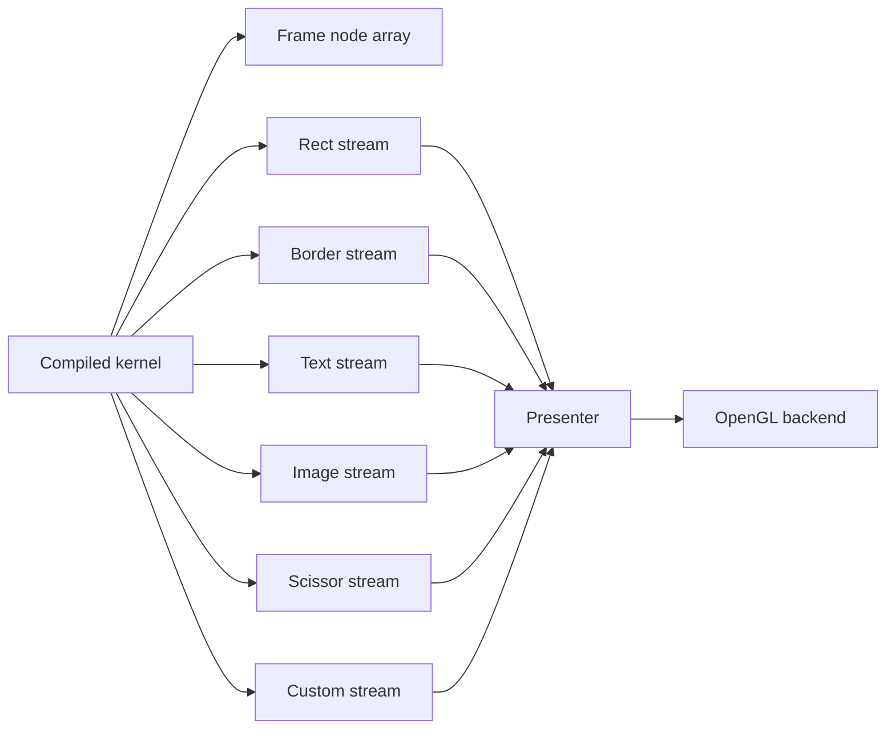
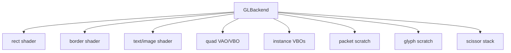
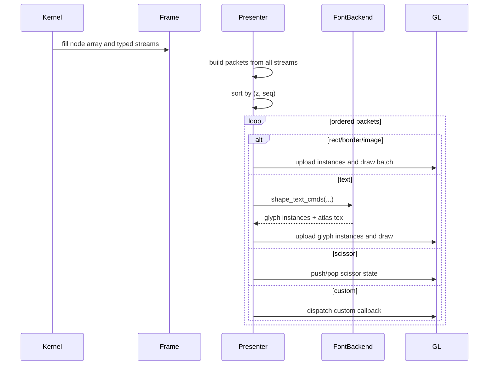

# TerraUI Runtime and OpenGL 3.3 Example Backend

Status: draft v0.2  
Source basis: final backend and presenter revisions in `starter-conv.txt`.

## 1. Scope

This document captures the runtime-facing architecture of the current OpenGL-oriented path:
- generated runtime types
- compile context contracts
- text/font backend integration
- OpenGL 3.3 backend design
- presenter ordering and batching

This document should be read as a **concrete backend example**, not the canonical abstract backend contract.

The broader backend/session ownership contract now lives in:
- `docs/design/12-backend-contracts.md`

## 2. Runtime model

The kernel ultimately runs against a frame object that contains:
- params
- state
- nodes
- hit state
- scroll state
- command streams
- viewport dimensions
- draw sequence counter

## 3. Runtime types

The design discussion repeatedly references these runtime records:
- `frame_t`
- `input_t`
- `node_t`
- `clip_state_t`
- `scroll_state_t`
- `hit_t`

## 4. Command streams

The final design keeps separate streams for:
- rects
- borders
- texts
- images
- scissors
- customs

Each stream has a backend-specific command struct synthesized by `CompileCtx`.

### 4.1 Required ordering fields

Every command must include:
- `seq`
- `z`

This is non-optional if split streams are preserved.

## 5. Runtime data flow



## 6. CompileCtx contract

The final conversation makes `CompileCtx` explicit. It must provide three categories of service.

### 6.1 Type synthesis

It produces Terra runtime types:
- params type
- state type
- input type
- hit type
- clip state type
- scroll state type
- command struct layouts

### 6.2 Binding lowering

It turns `Plan.Binding` into backend-specific Terra expressions:
- param access
- state access
- env access
- intrinsic lowering
- literal constructors

### 6.3 Command construction

It returns Terra quotes for typed command construction:
- `make_rect_cmd`
- `make_border_cmd`
- `make_text_cmd`
- `make_image_cmd`
- `make_scissor_start`
- `make_scissor_end`
- `make_custom_cmd`

## 7. Text backend in the OpenGL example path

Text is intentionally split across kernel and presenter.

### 7.1 Kernel-side text interface

In the OpenGL example path, the text backend must expose a measurement quote generator:

```lua
measure_quote(
    text_q,
    font_id_q,
    font_size_q,
    letter_spacing_q,
    line_height_q,
    wrap_mode,
    text_align,
    max_width_q
) -> TerraQuote
```

This is allowed to call a C function from Terra.

### 7.2 Presenter-side text interface

The backend must also expose shaping on the Lua/C side:

```lua
shape_text_cmds(text_cmds_ptr, first, count, glyph_scratch)
  -> glyph_ptr, glyph_bytes, glyph_count, atlas_tex
```

### 7.3 Design rule

Text commands remain high-level in the kernel. Only the presenter expands them into glyph instances.

## 8. Why text is split this way

Because text is the least stable part of the stack.

This approach lets TerraUI:
- keep layout and command generation compiled
- keep the kernel clean and backend-agnostic
- avoid embedding text shaping complexity into ASDL lowering or Terra quote generation

## 9. OpenGL 3.3 backend target

The final design targets OpenGL 3.3 core for v1 because it provides exactly what TerraUI needs:
- instanced draws
- divisor-based per-instance attributes
- scissor test
- dynamic streaming buffers
- simple quad-based rect/image/text drawing

## 10. OpenGL backend structure



## 11. Presenter contract

The runtime presenter is deliberately thin.

Responsibilities:
1. collect packets from every command stream
2. sort or merge by `(z, seq)`
3. maintain scissor stack
4. batch adjacent compatible packets
5. upload instance buffers
6. issue GL draws

## 12. Presenter ordering algorithm

The design sketch uses a packet list containing entries like:
- kind
- stream index
- z
- seq

Then:
1. gather packets from all streams
2. sort by `(z, seq)`
3. replay in order
4. batch contiguous same-kind packets when legal

## 13. Presenter sequence diagram



## 14. Scissor stack

Because clip regions nest, the backend must maintain a stack of active scissors.

Rules:
- `scissor begin` pushes a rect
- `scissor end` pops one
- current top is applied via GL scissor test
- empty stack disables scissor test

Also note:
- UI coordinates are top-left origin
- `glScissor` expects lower-left origin
- Y must be flipped on submission

## 15. Dynamic buffer uploads

The final conversation explicitly calls out the synchronization hazard of overwriting buffers that the GPU may still be using.

Recommended v1 policy:
- orphan or re-specify buffer storage each frame before upload
- use `GL_STREAM_DRAW`
- keep implementation conservative before optimizing further

## 16. OpenGL command families

### 16.1 Rects
Instanced quad path with:
- position/size
- premultiplied color
- radii
- opacity
- z

### 16.2 Borders
Instanced quad path with border thickness data.

### 16.3 Images
Instanced textured quads.

### 16.4 Text
High-level text commands shaped into textured glyph instances by the font backend.

### 16.5 Scissors
Not drawn directly; interpreted by the presenter as state changes.

### 16.6 Custom
Dispatched through a backend-specific callback path.

## 17. Slot storage model

The OpenGL compile context sketch stores params and state in typed arrays grouped by value kind:
- numbers
- bools
- strings
- colors
- images
- vec2s
- anys

This avoids per-slot runtime tagged storage.

## 18. CompileCtx environment helpers

The design sketch also expects environment bindings for things like:
- viewport width/height
- mouse x/y

These remain explicit backend/runtime hooks instead of magical globals.

## 19. Critical backend invariants

1. Split streams are preserved.
2. `seq` is mandatory on all emitted commands.
3. `draw_seq` resets per frame.
4. Text shaping happens after kernel execution.
5. Scissor stack mirrors clip begin/end nesting.
6. Buffer uploads avoid implicit GPU read/write hazards.

## 20. Why OpenGL is a good first backend

It is strict enough to force the design to become concrete, but small enough to implement without inventing a whole renderer abstraction first.

It also validates:
- stream-based command emission
- ordering correctness
- clipping/scissor semantics
- text split between measure and shape
- aspect-ratio-aware image rendering

## 21. Future backend portability

This design should later map to other renderers because the kernel only emits typed streams and the `CompileCtx` owns backend-specific type and command construction.

That means the core compiler should not need to change to support:
- a CPU debug renderer
- Vulkan
- Metal
- another GL variant
