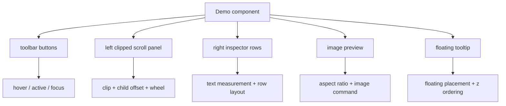
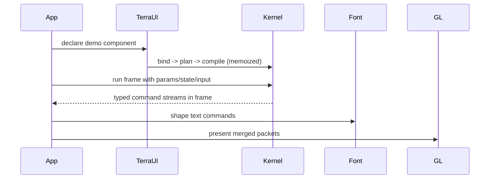

# TerraUI Vertical Prototype and Open Questions

Status: draft v0.2  
Source basis: final demo and prototype guidance in `starter-conv.txt`.

## 1. Immediate next step

The final discussion is explicit:

> the next thing worth doing is not more architecture. It’s a tiny vertical prototype.

That prototype should prove the full path:
- authored component
- bound IR
- plan flattening
- compiled kernel
- text measurement
- command emission
- presenter merge
- OpenGL draw
- real interaction

## 2. Prototype target

The recommended first demo is an inspector/editor-style UI with:
- root column
- toolbar row
- left scroll panel
- right property panel
- text labels
- colored buttons
- one image preview
- one floating tooltip

## 3. Coverage map



## 4. Prototype invariants to test

### 4.1 Deterministic specialization

This is the most important invariant test:

```text
same input tree + same specialization key = same compiled kernel
```

### 4.2 Clip correctness

Descendants of a clipped region must never escape the clip in rendering or hit testing.

### 4.3 Ordering correctness

Interleaved rect/text/image output must replay identically after stream merge by `(z, seq)`.

### 4.4 Text/backend split correctness

Text measurement must affect layout, but actual glyph expansion must happen after `run_fn` in the presenter path.

## 5. Suggested implementation order

### Step 1 — Font backend contract
Implement:
- `measure_quote(...)`
- atlas lookup
- `shape_text_cmds(...)`

Reason: text was identified as the last major fuzzy area.

### Step 2 — CPU-side presenter skeleton
Implement:
- packet merge by `(z, seq)`
- scissor stack
- rect/image instance submission
- text glyph batching

### Step 3 — One compiled demo surface
Implement the inspector demo tree.

### Step 4 — Invariant tests
Implement at least:
- stable specialization key test
- clip/hit correctness test
- merged ordering test

## 6. Prototype runtime sequence



## 7. What the first demo proves

If the demo works, TerraUI will have validated:
- the full phase pipeline
- Clay-like layout behavior
- clip and scroll offsets
- floating attachments
- compiled hit testing
- split render streams
- seq-based ordering recovery
- text measurement/shaping split
- OpenGL backend practicality

## 8. Concrete questions to resolve

These are the places where the conversation still leaves room for product/design decisions.

### Q1. Immediate-mode capture API
How do you want authored UI to look in user code?
- builder DSL in Lua/Terra
- schema-authored component objects
- a Dear ImGui-like function call style that lowers into `Decl.Node`

### Q2. Scroll state ownership
Should scroll offsets be:
- always runtime-managed by TerraUI
- always user-managed via state slots
- hybrid, where `ClipSpec` defaults to runtime scroll state but can also use explicit bound expressions

### Q3. Action dispatch model
For `Input.action`, do you want actions to be:
- string ids only
- numeric ids after binding
- callbacks stored outside the kernel and keyed by stable id/action id

### Q4. Focus model depth
Is v1 focus only:
- pointer focus / active item
or also:
- keyboard focus traversal and text input integration

### Q5. Custom leaf payloads
Should custom payloads be:
- opaque pointers/handles for v1
- typed schemas generated through ASDL
- backend-owned payload ids

### Q6. Stack/overlay primitive
Do you want stack/overlay to remain:
- authoring sugar over the existing node model
or become:
- a first-class layout mode in `Decl.Layout`

### Q7. Text backend ambition for v1
Is v1 text:
- simple atlas + basic wrapping
or do you already want:
- shaping and fallback behavior that will constrain the backend contract now

### Q8. Scroll clipping policy
When a node has `Clip(horizontal, vertical, ...)`, should hit testing outside the visible clipped region always be suppressed, even if child geometry exists there? The current design assumes yes.

### Q9. Z model
Should z be:
- explicitly authored only for floating/custom cases
- otherwise derived purely from preorder + seq
- or configurable per node in the public API later

### Q10. Public widget layer
Do you want the v1 public API to ship with higher-level widgets such as:
- button
- slider
- label
- inspector row
or keep v1 closer to raw node composition primitives

## 9. Recommended decision order

Resolve questions in this order:
1. capture API
2. scroll ownership
3. action dispatch model
4. custom payload model
5. text ambition for v1
6. widget layer scope

These affect implementation shape the most.

## 10. Success criteria for the prototype

The vertical slice is successful if it demonstrates:
- one stable pipeline
- one stable specialization story
- one real backend
- one real text path
- one convincing interactive demo
- at least one correctness/benchmark comparison against a more interpreted baseline
