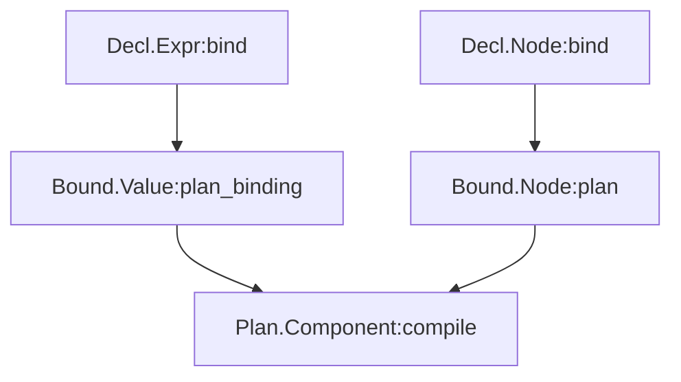
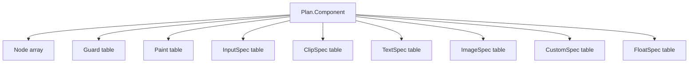

# TerraUI Full ASDL Specification

Status: draft v0.3  
Purpose: canonical companion document for the TerraUI ASDL.

## Canonical source

The canonical ASDL lives in:

- `docs/design/terraui.asdl`

This Markdown document explains the structure, rationale, and design adjustments, but the actual schema should stay in the `.asdl` file.

## 1. Module relationship

## 2. Method spine

## 3. Method declarations are part of the schema

The ASDL uses explicit `methods { ... }` declarations as part of the schema surface.

That matches the design intent from the conversation and the compiler-pattern writeup: lowering and codegen are not informal conventions, they are part of the type contract.

Practical implication:
- the `.asdl` file declares the required method surface
- the implementation layer must provide those methods with matching semantics
- validators should check declaration/implementation consistency

## 4. What the ASDL contains

The schema in `docs/design/terraui.asdl` defines four modules:

- `Decl` — authored immediate-mode description
- `Bound` — resolved / canonical tree
- `Plan` — flattened layout / paint / input plan
- `Kernel` — monomorphic compiled artifact

It also defines the external compile-time contract types:
- `TerraType`
- `TerraQuote`
- `BindCtx`
- `PlanCtx`
- `CompileCtx`

## 5. Important design adjustments made while finalizing the ASDL

This is not a blind copy of the raw conversation. The final `.asdl` includes a few deliberate cleanups:

1. `Decl.Component` no longer declares `specialization_key(...)` directly.

   Specialization now belongs to the bound form because the key depends on resolved params, state layout, and the bound root.

2. `Bound.SpecializationKey` includes:
   - renderer
   - text backend
   - params
   - state
   - root

   This makes specialization more complete than keying on root alone.

3. `Plan.Component` carries `Bound.SpecializationKey` directly rather than introducing a second incomplete plan-level key.

4. `Plan.Node` includes `subtree_end` so clipping can correctly bracket an entire subtree.

5. Optional plan slots use `number?` instead of compile-time `-1` sentinels.

6. `aspect_ratio` is represented once as an optional binding, without a redundant `has_aspect_ratio` boolean.

7. `Kernel.RuntimeTypes` includes `params_t` and `state_t` explicitly.

## 6. Main structural decisions reflected in the ASDL

### 6.1 Generic node model

The schema keeps one generic node record with optional features instead of a large node-kind union.

### 6.2 First-class clip model

`Clip` / `ClipSpec` are explicit schema elements rather than booleans smeared across node flags.

### 6.3 Node-level aspect ratio

`aspect_ratio` is on the node itself, so text, image, and custom leaves can all share the same box rule.

### 6.4 Flattened Plan side tables

`Plan` stores a dense node array plus typed side tables:
- guards
- paints
- inputs
- clips
- texts
- images
- customs
- floats

### 6.5 Narrow Kernel phase

`Kernel` remains record-oriented and avoids sum types.

## 7. Flattened Plan structure

## 8. Validation rules that should accompany the ASDL

These are not all expressible directly in ASDL syntax, so they should be enforced by the schema DSL or by validators.

### 7.1 Decl-level rules

1. `Percent(value)` should be constrained to `[0, 1]` unless over/underflow is intentionally allowed later.
2. Constant `aspect_ratio` values must be `> 0`.
3. In v1, a node with `leaf != nil` should not also have `children`.
4. `Indexed` ids must normalize to compile-time-stable values.
5. `FloatById` targets must resolve after binding.

### 7.2 Bound-level rules

1. `Bound.SpecializationKey` must be deterministic.
2. Theme/env sugar must not survive into `Bound.Value` except as explicit env slots.
3. Param/state slot numbering must be stable.

### 7.3 Plan-level rules

1. `subtree_end` is an exclusive preorder end.
2. Active clipping must cover the full subtree.
3. `LeafSlots` are mutually exclusive in v1.
4. Node-level `aspect_ratio` applies regardless of leaf kind.

### 7.4 Kernel-level rules

1. `Kernel` should stay record-only.
2. Draw ordering must be recoverable from split streams plus per-command ordering data.
3. Text shaping stays outside the kernel in v1.

## 9. Relationship to the other design docs

Use this document together with:

- `docs/design/01-ir-and-pipeline.md` for phase semantics
- `docs/design/02-layout-input-and-rendering.md` for layout, clipping, hit, and ordering rules
- `docs/design/03-runtime-backends-opengl.md` for runtime/backend implications

## 10. Canonical implementation target

For implementation work, treat:

- `docs/design/terraui.asdl` as the canonical schema source
- this file as the explanatory spec around it

## 11. Remaining intentionally open points

The ASDL is now strong enough to implement against, but a few product-level choices may still force small future revisions:
- whether `Input.action` remains `string?` or becomes an interned id
- whether `cursor` remains `string?` or becomes an enum/id
- whether stack/overlay stays authoring sugar only
- whether custom payloads stay opaque or become typed schemas
