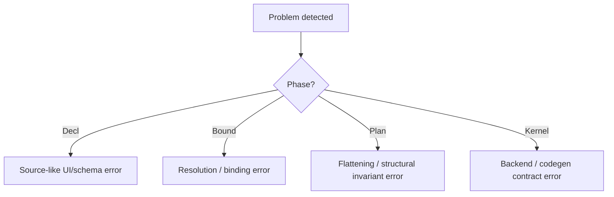

# TerraUI Validation Rules

Status: draft v0.4  
Purpose: define the validation rules that accompany `docs/design/terraui.asdl`.

Implementation note: the canonical design now separates `Clip` from `Scroll`. The current implementation still validates and lowers the older clip-plus-offset scroll model until migrated.

## Canonical schema

The canonical schema is:

- `docs/design/terraui.asdl`

This document defines the rules that must be enforced around that schema.

## 1. Why a separate validation layer exists

Raw ASDL can describe shape, but not every semantic invariant.

TerraUI needs validation because the architecture depends on:
- narrowing phases
- deterministic specialization
- correct subtree-scoped clipping
- monomorphic kernel output
- method declarations matching real lowering/codegen implementations

This follows the pattern described in `terra-compiler-pattern.md`: the schema layer should catch structural mistakes early and turn them into explicit compiler errors rather than downstream codegen failures.

## 2. Validation stages


## 3. Method declaration rules

ASDL method declarations are part of the schema contract and must be validated.

## 3.1 Declared methods are canonical

The following declarations in `terraui.asdl` are not comments or hints. They are part of the type contract and should be treated as required:

- `Decl.Component:bind(BindCtx) -> Bound.Component`
- `Decl.Param:bind(BindCtx) -> Bound.Param`
- `Decl.StateSlot:bind(BindCtx) -> Bound.StateSlot`
- `Decl.Node:bind(BindCtx) -> Bound.Node`
- `Decl.Visibility:bind(BindCtx) -> Bound.Visibility`
- `Decl.Layout:bind(BindCtx) -> Bound.Layout`
- `Decl.Size:bind(BindCtx) -> Bound.Size`
- `Decl.Padding:bind(BindCtx) -> Bound.Padding`
- `Decl.Decor:bind(BindCtx) -> Bound.Decor`
- `Decl.Border:bind(BindCtx) -> Bound.Border`
- `Decl.CornerRadius:bind(BindCtx) -> Bound.CornerRadius`
- `Decl.Clip:bind(BindCtx) -> Bound.Clip`
- `Decl.Scroll:bind(BindCtx) -> Bound.Scroll`
- `Decl.Floating:bind(BindCtx) -> Bound.Floating`
- `Decl.Input:bind(BindCtx) -> Bound.Input`
- `Decl.Leaf:bind(BindCtx) -> Bound.Leaf`
- `Decl.TextLeaf:bind(BindCtx) -> Bound.TextLeaf`
- `Decl.TextStyle:bind(BindCtx) -> Bound.TextStyle`
- `Decl.ImageLeaf:bind(BindCtx) -> Bound.ImageLeaf`
- `Decl.CustomLeaf:bind(BindCtx) -> Bound.CustomLeaf`
- `Decl.Expr:bind(BindCtx) -> Bound.Value`
- `Bound.Component:plan(PlanCtx) -> Plan.Component`
- `Bound.Node:plan(PlanCtx, number) -> number`
- `Bound.Size:plan(PlanCtx) -> Plan.SizeRule`
- `Bound.Clip:plan(PlanCtx, number) -> number`
- `Bound.Scroll:plan(PlanCtx, number) -> number`
- `Bound.Leaf:plan(PlanCtx, number) -> Plan.LeafSlots`
- `Bound.Value:plan_binding(PlanCtx) -> Plan.Binding`
- `Plan.Component:compile(CompileCtx) -> Kernel.Component`
- `Plan.Node:compile_layout(CompileCtx) -> TerraQuote`
- `Plan.Node:compile_hit(CompileCtx) -> TerraQuote`
- `Plan.SizeRule:compile_axis(CompileCtx, string) -> TerraQuote`
- `Plan.Paint:compile_emit(CompileCtx, number) -> TerraQuote`
- `Plan.InputSpec:compile_input(CompileCtx, number) -> TerraQuote`
- `Plan.ClipSpec:compile_apply(CompileCtx) -> TerraQuote`
- `Plan.ClipSpec:compile_emit_begin(CompileCtx) -> TerraQuote`
- `Plan.ClipSpec:compile_emit_end(CompileCtx) -> TerraQuote`
- `Plan.ScrollSpec:compile_apply(CompileCtx) -> TerraQuote`
- `Plan.ScrollSpec:compile_input(CompileCtx) -> TerraQuote`
- `Plan.TextSpec:compile_measure_width(CompileCtx) -> TerraQuote`
- `Plan.TextSpec:compile_measure_height_for_width(CompileCtx, TerraQuote) -> TerraQuote`
- `Plan.TextSpec:compile_emit(CompileCtx) -> TerraQuote`
- `Plan.ImageSpec:compile_emit(CompileCtx) -> TerraQuote`
- `Plan.CustomSpec:compile_emit(CompileCtx) -> TerraQuote`
- `Plan.FloatSpec:compile_place(CompileCtx) -> TerraQuote`
- `Plan.Binding:compile_bool(CompileCtx) -> TerraQuote`
- `Plan.Binding:compile_number(CompileCtx) -> TerraQuote`
- `Plan.Binding:compile_string(CompileCtx) -> TerraQuote`
- `Plan.Binding:compile_color(CompileCtx) -> TerraQuote`
- `Plan.Binding:compile_vec2(CompileCtx) -> TerraQuote`
- `Kernel.Component:frame_type() -> TerraType`
- `Kernel.Component:run_quote() -> TerraQuote`

## 3.2 Parent-before-child implementation rule

From `terra-compiler-pattern.md`, parent methods on ASDL classes must be defined before child methods because parent methods are copied into children at definition time.

That means implementation code must obey:
- define fallback parent methods first
- then define child overrides

Validator rule:

> if a method is declared on a sum parent type, the implementation layer must provide a valid parent fallback before child implementations are installed.

## 3.3 Exhaustiveness rule

For sum types with declared methods, every variant must either:
- inherit a valid generic implementation, or
- override it explicitly

At minimum, a schema/tooling validator should be able to report missing variant implementations for methods on:
- `Decl.Expr`
- `Decl.Leaf`
- `Decl.Size`
- `Bound.Value`
- `Bound.Leaf`
- `Bound.Size`
- `Plan.SizeRule`
- `Plan.Binding`

## 4. Structural schema rules

## 4.1 Phase order rule

Phase order is fixed:

```text
Decl -> Bound -> Plan -> Kernel
```

No method may lower backward across that ordering.

## 4.2 Final phase narrowing rule

`Kernel` should contain no sum types.

Validator rule:
- fail if a `Kernel` type becomes a tagged union
- warn if any future change introduces variant-heavy runtime artifacts into `Kernel`

## 4.3 Generic node rule

The schema intentionally keeps a generic node record instead of a giant node-kind union.

Validator rule:
- do not introduce container/leaf/widget-kind unions at `Node` level without an explicit design migration

## 4.4 Plan flattening rule

`Plan` is required to flatten node specialization into side tables.

Validator rule:
- node-specific payloads must live in side tables, not as embedded `Plan.Node` unions

## 5. Decl-level validation rules

## 5.1 Identity rules

1. `Stable(name)` names must be non-empty.
2. `Indexed(name, index)` names must be non-empty.
3. `Indexed(..., index)` must bind to a compile-time-stable value.
4. Duplicate stable ids inside one component are illegal after binding.

## 5.2 Node shape rules

1. In v1, a node may either be:
   - a container with children, or
   - a leaf node with a `leaf`

   but not both.

2. Empty nodes are allowed only if they are intentionally structural.

3. A node with `floating != nil` should still be a normal node in the tree; floating changes placement, not ownership.

## 5.3 Widget rules

1. Widget names must be unique inside one `Decl.Component`.
2. Widget prop names must be unique inside one `Decl.WidgetDef`.
3. Widget-local state names must be unique inside one `Decl.WidgetDef`.
4. Widget slot names must be unique inside one `Decl.WidgetDef`.
5. `WidgetCall(name, ...)` must refer to an existing widget definition.
6. Unknown widget props are illegal.
7. Duplicate widget prop arguments are illegal.
8. Missing required widget props are illegal.
9. Widget prop expressions/defaults with known types must be compatible with the declared widget prop type.
10. Unknown widget slots are illegal.
11. Duplicate widget slot arguments are illegal.
12. `SlotRef(name)` is only valid while elaborating a widget body.
13. `WidgetPropRef(name)` is only valid while binding a widget body.
14. `StateRef(name)` inside a widget body may refer to widget-local state first, then component state.
15. Direct or mutual recursive widget expansion is illegal in v1.

## 5.4 Layout rules

1. Constant `Percent(value)` must satisfy `0 <= value <= 1`.
2. Constant padding values should be `>= 0` unless negative layout is intentionally enabled later.
3. Constant gap values should be `>= 0`.
4. Constant aspect ratio must be `> 0`.
5. `Fit(min,max)` and `Grow(min,max)` must satisfy `min <= max` when both are constant.

## 5.5 Decor rules

1. Constant opacity must be in `[0,1]`.
2. Constant corner radii should be `>= 0`.
3. Constant border thickness values should be `>= 0`.

## 5.6 Clip and scroll rules

1. `Clip(horizontal=false, vertical=false)` is meaningless and should be rejected or warned.
2. `Scroll(horizontal=false, vertical=false)` is meaningless and should be rejected.
3. Scroll offsets are runtime-managed; authored structural scroll declarations should not carry `scroll_x` / `scroll_y` expressions.
4. If a node carries both explicit `Clip` and `Scroll`, effective clip is the union of enabled axes.

## 5.7 Floating rules

1. `FloatById` targets must resolve after binding.
2. A floating node attached to `FloatParent` requires a real parent; floating root nodes to parent is invalid.
3. Constant z-index values should be finite.

## 5.8 Text rules

1. Constant `font_size` should be `> 0`.
2. Constant `line_height` should be `> 0`.
3. Constant `letter_spacing` may be negative only if the text backend explicitly allows it.
4. `content` must bind to a string-typed value at type-check time.

## 5.9 Image rules

1. `image_id` must bind to an image-compatible value.
2. `fit` must be one of the declared enum values only.

## 5.10 Custom leaf rules

1. `kind` must be non-empty.
2. Payload typing rules are backend/product policy and should be checked separately.

## 5.11 Expression rules

1. `ParamRef` must refer to an existing parameter.
2. `StateRef` must refer to an existing state slot.
3. `WidgetPropRef` must refer to an existing widget prop in the current widget elaboration frame.
4. `ThemeRef` must be fully resolved or converted into an explicit environment/bound value during binding.
5. `EnvRef` names must belong to the allowed environment surface.
6. `Call(fn, args)` must resolve to a known intrinsic during binding unless user-defined intrinsics are explicitly supported.

## 6. Bound-level validation rules

## 6.1 Canonicalization rules

1. `Bound.Value` must contain no theme sugar.
2. `Bound.Value` must contain no unresolved author names except explicit environment names.
3. Slot numbering for params and state must be deterministic.

## 6.2 Specialization key rules

1. `Bound.SpecializationKey` must be deterministic.
2. Key equality must be structural.
3. If two bound components are semantically identical for code generation, they must produce equal specialization keys.

## 6.3 Stable id rules

1. Every bound node must have exactly one resolved stable id.
2. Stable id collisions are an error.

## 7. Plan-level validation rules

## 7.1 Tree flattening rules

1. `root_index` must refer to an existing node.
2. Node indices must be dense and unique.
3. `first_child` and `child_count` must match the flattened preorder layout.
4. `subtree_end` must be the exclusive preorder end of the node subtree.

## 7.2 Slot reference rules

1. Required slots (`guard_slot`, `paint_slot`, `input_slot`) must always refer to valid table entries.
2. Optional slots (`clip_slot`, `scroll_slot`, `text_slot`, `image_slot`, `custom_slot`, `float_slot`) must either be absent or point to valid entries.
3. `LeafSlots` must be mutually exclusive in v1.

## 7.3 Clip and scroll rules

1. `ClipSpec.node_index` must refer to the node owning the clip.
2. `ScrollSpec.node_index` must refer to the node owning the scroll viewport.
3. Clip begin/end must bracket the full subtree of the clipped node.
4. Scrolling is not represented as clip child offsets; scroll translation is owned by `ScrollSpec`.
5. Scroll range must be derived from content extent versus viewport size.

## 7.4 Float rules

1. `attach_parent_slot` must be valid.
2. Floating target resolution must be complete before compile.
3. Pointer capture mode must be one of the declared enum values.

## 7.5 Binding rules

1. `Plan.Binding` must be the last union-heavy value carrier before codegen.
2. No unresolved Decl/Bound authoring sugar should survive into `Plan.Binding`.
3. `Expr(op, args)` must target a supported compile context intrinsic.

## 8. Kernel-level validation rules

## 8.1 Monomorphism rule

The compiled kernel artifact should remain structurally narrow.

Validator rule:
- reject new sum types in `Kernel`
- reject attempts to model draw commands as a single tagged union in generic kernel IR

## 8.2 Backend ordering rule

Even though `seq` is not encoded in the generic ASDL, any concrete backend command layout used by `CompileCtx` must include enough ordering data to recover global interleaving.

For v1 that means:
- every concrete command type gets a `seq`
- every command also carries `z`
- presenter replays split streams in `(z, seq)` order

## 8.3 Text split rule

Text shaping remains outside `Kernel` in v1.

Validator rule:
- backend compile contexts may expose text measurement quotes
- glyph shaping belongs to the presenter/font backend stage, not kernel IR

## 9. Backend contract validation

## 9.1 CompileCtx contract rules

A `CompileCtx` implementation must provide:
- type synthesis methods
- binding reference methods
- intrinsic lowering methods
- command constructor methods
- text measurement support
- runtime scroll helpers when scroll viewports are enabled

## 9.2 OpenGL/backend rules

For the current design set:
- concrete command structs must expose ordering fields
- scissor commands must support nested stack semantics
- image commands must preserve fit/aspect-ratio semantics
- text commands remain high-level until presenter shaping

## 10. Error reporting guidance

The validation layer should produce errors as early and specifically as possible.

Preferred ordering:
1. schema/load-time structural errors
2. Decl construction errors
3. bind-time resolution errors
4. plan-time flattening/invariant errors
5. compile/backend contract errors

## 11. Recommended validator outputs



Good validator messages should name:
- the phase
- the type and method involved
- the node id or field name if available
- the violated invariant

## 12. Most important invariants to enforce first

If validation starts small, prioritize these rules first:

1. method declaration/implementation consistency
2. parent-before-child ASDL method installation discipline
3. deterministic specialization key
4. unique bound stable ids
5. no leaf+children in v1
6. valid `subtree_end`
7. full-subtree clip bracketing
8. backend ordering support via `(z, seq)`
