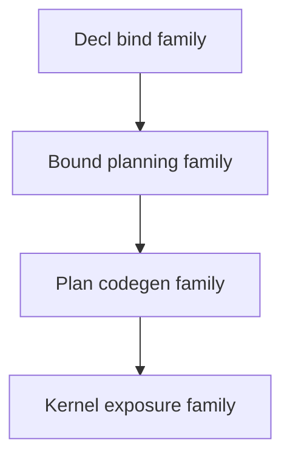

# TerraUI Method Contracts

Status: draft v0.3  
Purpose: define the required semantics of every method declared in `docs/design/terraui.asdl`.

## Canonical schema

The canonical ASDL is:

- `docs/design/terraui.asdl`

This document does **not** redefine the schema. It defines what each declared method must mean.

## 1. Why this document exists

The Terra compiler pattern used by TerraUI treats methods on ASDL types as part of the compiler architecture, not as optional helpers.

That means method declarations in the ASDL must have:

- stable meaning
- deterministic behavior
- phase-correct return values
- explicit purity expectations

This document is the semantic contract for those methods.

## 2. Global method rules

## 2.1 Purity rule

ASDL methods should behave as pure functions of:

- `self`
- explicit arguments
- immutable compile-time context passed in

They should not depend on mutable ambient global state.

This follows the rule in `terra-compiler-pattern.md` that property/method logic should be functional and produce the same result regardless of evaluation timing.

## 2.2 Determinism rule

Given equal inputs, a method must produce equal outputs.

Examples:

- `Decl.Expr:bind(ctx)` must produce the same `Bound.Value` for the same expression and binding context
- `Bound.Node:plan(ctx, parent_index)` must allocate the same structural plan shape under the same deterministic planner state
- `Plan.Component:compile(ctx)` must produce the same compiled kernel for the same plan and backend specialization

## 2.3 Phase monotonicity rule

Methods may only lower forward:

```text
Decl -> Bound -> Plan -> Kernel
```

No declared method may return an earlier phase.

## 2.4 Parent-before-child implementation rule

Per `terra-compiler-pattern.md`, parent methods on ASDL classes must be installed before child methods, because parent methods are copied into children at definition time.

Implementation rule:

- define parent fallback methods first
- define child overrides second

## 2.5 ASDL methods vs exotype metamethods

The compiler-pattern document makes an important distinction:
- ASDL methods are the phase-lowering surface
- exotype metamethods such as `__methodmissing`, `__entrymissing`, `__getentries`, `__cast`, and `__for` are Terra compile-time dispatch hooks on generated structs/types

For TerraUI:
- `Decl/Bound/Plan/Kernel` methods should express lowering and codegen intent
- generated Terra types may still use metamethods for ergonomic compile-time APIs
- `__methodmissing` should be reserved for cases where Terra method syntax itself should trigger specialization

## 2.6 Error contract rule

A method must fail as early and specifically as possible when its preconditions are violated.

Typical failures should name:

- the phase
- the method
- the relevant type or variant
- the violated invariant

## 3. Overall lowering spine


## 3.1 Current implementation snapshot

As of the current implementation:

### Fully implemented families
- `Decl.*:bind`
- `Bound.*:plan`
- `Bound.Value:plan_binding`
- `Plan.Component:compile`
- `Plan.Binding:compile_number`
- `Plan.Binding:compile_bool`
- `Plan.Binding:compile_string`
- `Plan.Binding:compile_color` (const/slot coverage used by current kernel)
- `Plan.Binding:compile_vec2` (const coverage)
- `Kernel.Component:frame_type`
- `Kernel.Component:run_quote`

### Implemented plan codegen semantics
- layout
- intrinsic text measurement placeholder
- fit/grow/fixed/percent sizing
- alignment
- aspect ratio
- clip child offsets
- floating placement
- hit testing
- basic input transitions
- rect/border/text/image/custom/scissor emission
- guard evaluation for visible/enabled

### Still partial / backend-placeholder
- text measurement is currently a simple placeholder, not a real font backend contract
- image/custom intrinsic measurement is still minimal
- stream emit functions exist at the kernel level, but presenter/backend replay is still outside the current implementation

## 4. Decl-phase method contracts

These methods convert authored syntax into canonical bound forms.

## 4.1 `Decl.Component:bind(BindCtx) -> Bound.Component`

### Purpose

Bind the full authored component into a canonical `Bound.Component`.

### Inputs

- component name
- param declarations
- state declarations
- widget definitions
- root node
- `BindCtx`

### Required behavior

- bind params in stable declaration order
- bind component-level state in stable declaration order
- register widget definitions in stable declaration order
- bind the root node
- elaborate widget calls away during binding
- expand widget-local state into deterministic component state slots during elaboration
- construct `Bound.SpecializationKey`
- return a fully resolved `Bound.Component`

### Must guarantee

- output is deterministic
- params/state slot numbering is stable
- bound root is canonical
- specialization key is complete enough for memoized compilation

### Must not do

- emit Terra quotes
- depend on runtime values

## 4.2 `Decl.Param:bind(BindCtx) -> Bound.Param`

### Purpose

Assign a deterministic slot to a parameter declaration.

### Required behavior

- preserve name and declared value type
- assign exactly one stable slot index

### Validation expectations

- duplicate param names are illegal
- default values, if present, should type-check against the declared type

## 4.3 `Decl.StateSlot:bind(BindCtx) -> Bound.StateSlot`

### Purpose

Assign a deterministic slot to a state declaration and bind its optional initializer.

### Required behavior

- preserve name and value type
- assign stable slot index
- bind `initial` if present into `Bound.Value`

### Validation expectations

- duplicate state names are illegal
- initializer must type-check against declared type

## 4.4 `Decl.Node:bind(BindCtx) -> Bound.Node`

### Purpose

Convert one authored node into one canonical bound node.

### Required behavior

- allocate deterministic local id
- resolve stable id
- bind visibility, layout, decor, clip, floating, input, aspect ratio, leaf, children
- elaborate `Decl.Child` entries:
  - `NodeChild` binds directly
  - `WidgetChild` resolves the widget definition and elaborates it away
  - `SlotRef` splices the current widget slot children
- preserve child order exactly after elaboration

### Must guarantee

- every bound node has exactly one resolved stable id
- authoring sugar is removed
- no child reordering occurs

### Validation expectations

- in v1, `leaf` and `children` must not both be populated
- floating target ids are not fully validated here if they require whole-tree knowledge, but they must be representable in bound form

## 4.5 `Decl.Visibility:bind(BindCtx) -> Bound.Visibility`

### Purpose

Bind optional visible/enabled expressions into bound values.

### Must guarantee

- absence stays absence
- present expressions are reduced to `Bound.Value`

## 4.6 `Decl.Layout:bind(BindCtx) -> Bound.Layout`

### Purpose

Bind authored layout configuration into canonical bound layout form.

### Required behavior

- preserve axis and alignment enums
- bind width/height size rules
- bind padding and gap

## 4.7 `Decl.Size:bind(BindCtx) -> Bound.Size`

### Purpose

Bind authored size rules into bound size rules.

### Required behavior per variant

- `Fit(min,max)` -> `Bound.Fit(...)`
- `Grow(min,max)` -> `Bound.Grow(...)`
- `Fixed(value)` -> `Bound.Fixed(...)`
- `Percent(value)` -> `Bound.Percent(...)`

### Validation expectations

- constant `Percent` must be in `[0,1]`
- constant `min/max` must satisfy `min <= max`

## 4.8 `Decl.Padding:bind(BindCtx) -> Bound.Padding`

### Purpose

Bind all four padding expressions.

### Validation expectations

- constant values should be non-negative in v1

## 4.9 `Decl.Decor:bind(BindCtx) -> Bound.Decor`

### Purpose

Bind optional background, border, radius, and opacity.

### Must guarantee

- absent optional fields stay absent
- present values become bound values or bound subrecords

## 4.10 `Decl.Border:bind(BindCtx) -> Bound.Border`

### Purpose

Bind border thickness/color expressions.

### Validation expectations

- constant thickness values should be non-negative

## 4.11 `Decl.CornerRadius:bind(BindCtx) -> Bound.CornerRadius`

### Purpose

Bind corner radius expressions.

### Validation expectations

- constant radius values should be non-negative

## 4.12 `Decl.Clip:bind(BindCtx) -> Bound.Clip`

### Purpose

Bind clip structure and optional child offsets.

### Required behavior

- preserve horizontal/vertical clip flags
- bind optional child offsets

### Validation expectations

- clip with both axes disabled should be rejected or warned

## 4.13 `Decl.Floating:bind(BindCtx) -> Bound.Floating`

### Purpose

Bind floating placement semantics.

### Required behavior

- bind float target into bound target form
- preserve attach points and pointer capture mode
- bind offsets, expansion values, and z-index

### Validation expectations

- unresolved `FloatById` should fail by the end of planning at latest

## 4.14 `Decl.Input:bind(BindCtx) -> Bound.Input`

### Purpose

Preserve node interaction policy in canonical form.

### Required behavior

- copy booleans and optional metadata without semantic change

## 4.15 `Decl.Leaf:bind(BindCtx) -> Bound.Leaf`

### Purpose

Bind one leaf payload variant.

### Variant behavior

- `Text` -> `Bound.Text`
- `Image` -> `Bound.Image`
- `Custom` -> `Bound.Custom`

### Exhaustiveness requirement

All leaf variants must be handled.

## 4.16 `Decl.TextLeaf:bind(BindCtx) -> Bound.TextLeaf`

### Purpose

Bind text content and text style.

### Validation expectations

- content should type-check as string-compatible by type analysis time

## 4.17 `Decl.TextStyle:bind(BindCtx) -> Bound.TextStyle`

### Purpose

Bind text styling expressions.

### Validation expectations

- constant font size > 0
- constant line height > 0

## 4.18 `Decl.ImageLeaf:bind(BindCtx) -> Bound.ImageLeaf`

### Purpose

Bind image payload and fit mode.

### Validation expectations

- image id must type-check as image-compatible

## 4.19 `Decl.CustomLeaf:bind(BindCtx) -> Bound.CustomLeaf`

### Purpose

Bind custom payload kind and optional payload expression.

### Validation expectations

- `kind` must be non-empty

## 4.20 `Decl.Expr:bind(BindCtx) -> Bound.Value`

### Purpose

Lower rich authored expressions into canonical bound values.

### Required behavior

- resolve params and states to slots
- eliminate theme sugar
- preserve only explicit env references
- fold obvious constant expressions when safe
- map calls to canonical intrinsics

### Must guarantee

- no authored naming sugar survives except allowed env slot names
- output fits `Bound.Value`

### Exhaustiveness requirement

All expression variants must be handled.

## 5. Bound-phase method contracts

These methods convert canonical trees into flattened plan structures.

## 5.1 `Bound.Component:plan(PlanCtx) -> Plan.Component`

### Purpose

Flatten the full bound component into one plan component.

### Required behavior

- lower the full node tree into dense node order
- collect side tables
- preserve specialization key
- set `root_index`
- produce a valid `Plan.Component`

### Must guarantee

- plan indices are deterministic
- side tables and slots are internally consistent

## 5.2 `Bound.Node:plan(PlanCtx, number parent_index) -> number`

### Purpose

Flatten a single bound node into the planner and return its node index.

### Required behavior

- reserve a node index
- allocate guard/paint/input slots
- allocate optional clip/leaf/float slots
- bind stable id to node index
- lower children in preorder
- compute `subtree_end`
- store final `Plan.Node`
- return own index

### Must guarantee

- preorder is deterministic
- `subtree_end` is exclusive subtree end
- slot references point to valid side-table entries

### Notes

The root call may use `-1` as an implementation-level parent sentinel even though the ASDL stores `parent` as optional.

## 5.3 `Bound.Size:plan(PlanCtx) -> Plan.SizeRule`

### Purpose

Convert bound size rules into plan size rules using plan bindings.

### Must guarantee

- no `Bound.Value` survives in the result

## 5.4 `Bound.Clip:plan(PlanCtx, number node_index) -> number`

### Purpose

Create a `Plan.ClipSpec` for the node and return its slot index.

### Must guarantee

- `ClipSpec.node_index` matches the owning node

## 5.5 `Bound.Leaf:plan(PlanCtx, number node_index) -> Plan.LeafSlots`

### Purpose

Allocate leaf-specific side-table entries and return the corresponding slots.

### Required behavior

- text leaf -> text slot only
- image leaf -> image slot only
- custom leaf -> custom slot only

### Must guarantee

- v1 mutual exclusivity of leaf slots

## 5.6 `Bound.Value:plan_binding(PlanCtx) -> Plan.Binding`

### Purpose

Convert a bound value into the final pre-codegen binding carrier.

### Required behavior

- constants remain constants
- slots become `Param` / `State`
- env stays `Env`
- operations become `Expr(op,args)`

### Must guarantee

- no authored sugar remains
- this is the last union-heavy value form before code generation

## 6. Plan-phase method contracts

These methods produce Terra quotes or compiled kernel artifacts.

## 6.1 `Plan.Component:compile(CompileCtx) -> Kernel.Component`

### Purpose

Compile the full plan into one kernel artifact.

### Required behavior

- request backend/runtime types from `CompileCtx`
- generate compiled quotes/functions for layout, input, hit testing, and run
- preserve specialization identity
- return a `Kernel.Component`

### Must guarantee

- output is deterministic for equal plan + compile context specialization
- no plan-time unions leak into kernel structure

## 6.2 `Plan.Node:compile_layout(CompileCtx) -> TerraQuote`

### Purpose

Generate the layout logic for one planned node.

### Required behavior

- resolve available size from parent/root context
- compute intrinsic contributions
- resolve width/height by size rule
- apply node aspect ratio when present
- compute content rect
- apply clip child offsets when present
- place children deterministically
- cooperate with text/image intrinsic measurement paths

### Must guarantee

- respects node-local layout semantics
- respects clip child-space semantics
- does not emit rendering commands directly unless the architecture explicitly couples them later

## 6.3 `Plan.Node:compile_hit(CompileCtx) -> TerraQuote`

### Purpose

Generate hit-testing logic for one node.

### Required behavior

- test visibility and enabled state
- test node bounds
- intersect against active ancestor clip bounds
- update runtime hot/active/focus state as appropriate

### Must guarantee

- clip ancestry is respected

### Current implementation note

Implemented. The current kernel uses effective per-node clip bounds computed during layout and tests pointer coordinates against both node rect and clip rect.

## 6.4 `Plan.SizeRule:compile_axis(CompileCtx, string axis_name) -> TerraQuote`

### Purpose

Generate code for applying a size rule on one axis.

### Required behavior

- handle fit/grow/fixed/percent exhaustively
- clamp by min/max when present

## 6.5 `Plan.Paint:compile_emit(CompileCtx, number node_index) -> TerraQuote`

### Purpose

Emit node-local visual commands for the node’s paint data.

### Required behavior

- emit background and border geometry as needed
- respect opacity and radius data
- not own subtree clip bracketing semantics by itself

### Important constraint

Clip begin/end for descendants is a subtree concern, not merely local paint.

### Current implementation note

This is implemented. Node-local paint emits rect and border commands; subtree clip bracketing is emitted separately by `ClipSpec:compile_emit_begin/end`.

## 6.6 `Plan.InputSpec:compile_input(CompileCtx, number node_index) -> TerraQuote`

### Purpose

Generate interaction logic for one node’s input policy.

### Required behavior

- handle hover/press/focus/wheel flags
- respect node visibility/enabled state
- cooperate with runtime input record format

### Current implementation note

Basic press/release/focus/action behavior is implemented. Wheel-specific runtime behavior is not yet fleshed out.

## 6.7 `Plan.ClipSpec:compile_apply(CompileCtx) -> TerraQuote`

### Purpose

Apply clip child offsets into node content space.

### Required behavior

- adjust child/content origin, not parent outer box
- read runtime scroll helpers if clip offsets are runtime-managed

## 6.8 `Plan.ClipSpec:compile_emit_begin(CompileCtx) -> TerraQuote`

### Purpose

Emit the backend clip/scissor begin command for this clip region.

### Must guarantee

- output can participate in subtree-scoped clip bracketing

### Current implementation note

Implemented via high-level `ScissorCmd` begin packets.

## 6.9 `Plan.ClipSpec:compile_emit_end(CompileCtx) -> TerraQuote`

### Purpose

Emit the matching backend clip/scissor end command.

### Must guarantee

- correctly pairs with begin during subtree replay

### Current implementation note

Implemented via matching high-level `ScissorCmd` end packets.

## 6.10 `Plan.TextSpec:compile_measure_width(CompileCtx) -> TerraQuote`

### Purpose

Generate the intrinsic max-content width measurement logic for one text leaf.

### Required behavior

- call compile-context text measurement support or an equivalent backend-facing helper
- respect font, spacing, explicit newline boundaries, and other style settings that affect max-content width
- not require a parent width constraint

### Current implementation note

The current implementation delegates width measurement through `CompileCtx.text_measurer`. The bundled default measurer still uses a placeholder average-advance metric, but the compiler core no longer hardcodes that policy.

## 6.11 `Plan.TextSpec:compile_measure_height_for_width(CompileCtx, TerraQuote max_width) -> TerraQuote`

### Purpose

Generate height-for-width measurement logic for one text leaf under a concrete width constraint.

### Required behavior

- respect wrap mode, alignment-related backend constraints, font, spacing, and line-height settings
- treat `WrapWords` as width-dependent
- allow explicit newline-only measurement for `WrapNewlines`
- return a height quote usable during layout remeasurement

### Current implementation note

The current implementation delegates height-for-width measurement through `CompileCtx.text_measurer`. The bundled default measurer still uses a simple approximation, while the SDL demo now installs an SDL_ttf-backed measurer so layout and replay share the same text backend there.

## 6.12 `Plan.TextSpec:compile_emit(CompileCtx) -> TerraQuote`

### Purpose

Emit one high-level text draw command.

### Required behavior

- emit text command data only
- not shape glyphs directly in kernel code

### Current implementation note

This is implemented. The current kernel emits high-level `TextCmd` values carrying text/style/rect data. Glyph shaping is still external to the kernel.

## 6.13 `Plan.ImageSpec:compile_emit(CompileCtx) -> TerraQuote`

### Purpose

Emit one image draw command.

### Required behavior

- preserve fit mode
- cooperate with node-level aspect ratio semantics

### Current implementation note

This is implemented at the stream-emission level. Image intrinsic measurement is still minimal.

## 6.14 `Plan.CustomSpec:compile_emit(CompileCtx) -> TerraQuote`

### Purpose

Emit one custom draw command.

### Required behavior

- preserve custom kind
- preserve payload reference/value

### Current implementation note

The current kernel emits `CustomCmd` with rect + `kind`. Payload preservation at backend replay level is still minimal in v1.

## 6.15 `Plan.FloatSpec:compile_place(CompileCtx) -> TerraQuote`

### Purpose

Generate floating placement logic.

### Required behavior

- resolve target parent node
- map attach points to coordinates
- apply offsets and expansion
- set z-index semantics for floating node placement

### Current implementation note

This is implemented for the current static-tree kernel. Floating nodes are removed from normal flow, then placed in a later layout pass against their resolved target.

## 6.16 `Plan.Binding:compile_bool(CompileCtx) -> TerraQuote`

## 6.17 `Plan.Binding:compile_number(CompileCtx) -> TerraQuote`

## 6.18 `Plan.Binding:compile_string(CompileCtx) -> TerraQuote`

## 6.19 `Plan.Binding:compile_color(CompileCtx) -> TerraQuote`

## 6.20 `Plan.Binding:compile_vec2(CompileCtx) -> TerraQuote`

### Purpose

Compile a plan binding into a backend-specific Terra quote of the requested value kind.

### Required behavior

- constants lower to direct literals
- param/state/env references lower through `CompileCtx`
- `Expr(op,args)` lowers through compile-context intrinsic logic

### Must guarantee

- requested kind matches the binding’s semantic type
- generated quote is deterministic

### Exhaustiveness requirement

All `Plan.Binding` variants must be handled.

## 7. Kernel-phase method contracts

These methods expose the compiled artifact.

## 7.1 `Kernel.Component:frame_type() -> TerraType`

### Purpose

Return the generated runtime frame type for this compiled kernel.

### Must guarantee

- returned type matches the frame expected by compiled kernel functions

## 7.2 `Kernel.Component:run_quote() -> TerraQuote`

### Purpose

Return the runnable Terra quote or callable entry expression associated with this kernel.

### Must guarantee

- quote is compatible with the generated runtime types

## 8. Method-family summary



## 9. Priority implementation order

If implementing these methods incrementally, start here:

1. `Decl.Expr:bind`
2. `Decl.Node:bind`
3. `Bound.Value:plan_binding`
4. `Bound.Node:plan`
5. `Plan.Component:compile`
6. `Plan.Node:compile_layout`
7. `Plan.Node:compile_hit`
8. `Plan.TextSpec:compile_measure_width` / `Plan.TextSpec:compile_measure_height_for_width`
9. `Plan.Paint:compile_emit`
10. remaining emit/place helpers

This matches the design evolution already present in the conversation history.
