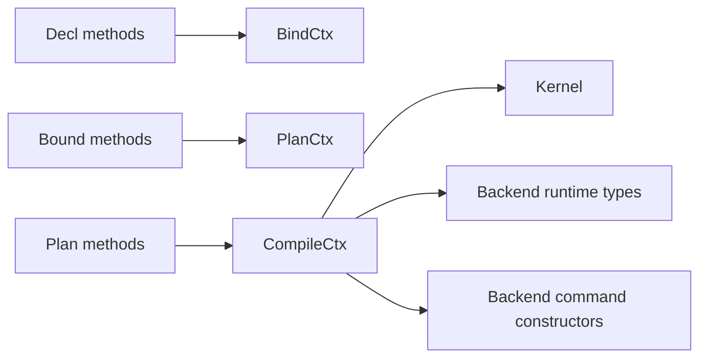
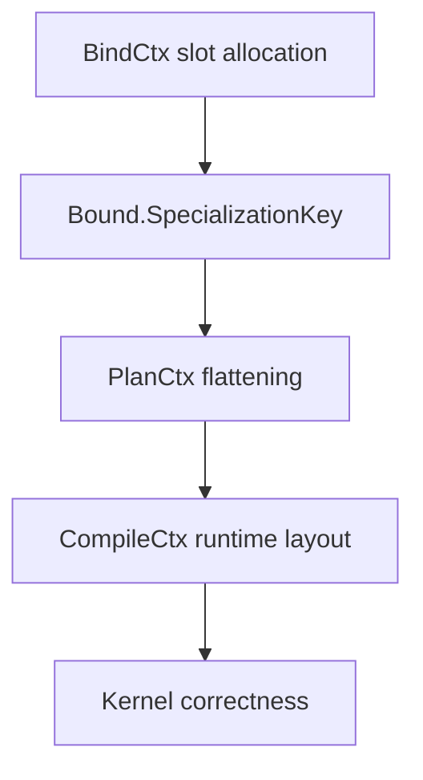

# TerraUI Context Contracts

Status: draft v0.3  
Purpose: define the semantic contract for `BindCtx`, `PlanCtx`, and `CompileCtx` used by the TerraUI compiler pipeline.

## Canonical schema

The canonical ASDL is:

- `docs/design/terraui.asdl`

The canonical method contracts are:

- `docs/design/07-method-contracts.md`

This document specifies the compile-time context objects that those methods depend on.

## 1. Why these contracts matter

In TerraUI, the ASDL methods are only half the compiler interface.

The other half is the context objects they call into:
- `BindCtx`
- `PlanCtx`
- `CompileCtx`

If those contracts stay vague, the ASDL methods are still underspecified. This document makes them explicit enough that implementation can start without hidden assumptions.

## 2. Context role diagram



## 3. Global rules for all contexts

## 3.1 Determinism rule

All context operations that affect compiler output must be deterministic.

Equal inputs must produce equal outputs.

## 3.2 Phase-locality rule

Each context may only expose services appropriate to its phase:
- `BindCtx` must not emit backend Terra command structs
- `PlanCtx` must not invent runtime backend semantics
- `CompileCtx` must not depend on authored Decl sugar

## 3.3 Purity boundary rule

Contexts may maintain internal bookkeeping state, but their externally observable semantic behavior must be pure with respect to the compiler pipeline.

That means internal mutation is allowed for:
- slot allocation
- node index allocation
- stable-id maps
- backend type caches

But equal compilation inputs must still produce equal outputs.

## 4. BindCtx

`BindCtx` serves the `Decl -> Bound` phase.

## 4.1 BindCtx responsibilities

- slot allocation for params and state
- widget-definition registration and lookup
- widget prop / slot environment management during widget elaboration
- theme resolution
- intrinsic resolution
- deterministic node-id allocation
- deterministic widget-instance allocation
- stable path bookkeeping for ids
- widget-scope bookkeeping for namespaced ids

## 4.2 BindCtx contract surface

The final design discussion converged on a surface like this:

```lua
BindCtx = {
    param_slot          = function(self, name) -> number end,
    state_slot          = function(self, name) -> number end,
    register_widget     = function(self, def) end,
    widget_def          = function(self, name) -> Decl.WidgetDef end,
    resolve_widget_prop = function(self, name) -> Bound.Value end,
    resolve_slot_children = function(self, name) -> Decl.Child* end,
    bind_widget_call    = function(self, call) -> Bound.Node end,
    resolve_theme       = function(self, name) -> any end,
    resolve_intrinsic   = function(self, fn, arity) -> string? end,

    alloc_node_id       = function(self) -> number end,
    alloc_widget_id     = function(self) -> number end,
    push_path           = function(self, base, local_id) end,
    pop_path            = function(self) end,
    path_string         = function(self) -> string end,
    widget_scope_string = function(self) -> string? end,
}
```

## 4.3 `param_slot(name) -> number`

### Purpose
Return the deterministic slot index for a parameter name.

### Required behavior
- same name inside same component bind pass -> same slot
- unknown name -> fail clearly

### Must guarantee
- slot numbering is stable in declaration order
- duplicate names are rejected before or during resolution

## 4.4 `state_slot(name) -> number`

### Purpose
Return the deterministic slot index for a state slot name.

### Required behavior
- same name inside same component bind pass -> same slot
- inside widget elaboration, widget-local state names shadow outer component state names
- unknown name -> fail clearly

### Must guarantee
- slot numbering is stable in declaration order for component state
- widget-local state slot numbering is stable in widget-expansion order

## 4.5 `resolve_theme(name) -> any`

### Purpose
Resolve a theme reference during binding.

### Required behavior
Must return one of:
- a constant bindable value
- an environment-backed reference description
- failure if the theme symbol is unknown

### Must guarantee
- theme sugar does not survive into `Bound.Value` except through explicit allowed environment/value forms

## 4.6 `resolve_intrinsic(fn, arity) -> string?`

### Purpose
Resolve authored call syntax into canonical intrinsic names.

### Required behavior
- map `(name, arity)` to a canonical intrinsic id/string
- return `nil` or fail for unsupported calls

### Must guarantee
- canonical names are stable
- equivalent spellings do not diverge nondeterministically

## 4.7 `alloc_node_id() -> number`

### Purpose
Allocate deterministic local node ids during binding.

### Required behavior
- allocate in stable preorder or author traversal order
- never reuse inside one component bind pass

## 4.8 `push_path(base, local_id)` / `pop_path()` / `path_string() -> string`

### Purpose
Track deterministic structural path context while binding nested nodes.

### Why this exists
This supports generation of stable auto ids and debug-friendly structural identity.

### Must guarantee
- push/pop nesting is balanced
- `path_string()` is deterministic for equal authored structure

## 4.9 BindCtx invariants

1. param/state slot allocation is stable
2. widget definitions are uniquely named within one component bind pass
3. widget prop/slot environments are stack-balanced during elaboration
4. path bookkeeping is balanced
5. intrinsic resolution is canonical
6. theme resolution removes author-time sugar
7. local node ids are unique per component bind pass
8. widget-instance ids are deterministic per component bind pass
9. widget-local stable ids are namespaced deterministically

## 5. PlanCtx

`PlanCtx` serves the `Bound -> Plan` phase.

## 5.1 PlanCtx responsibilities

- allocate dense plan node indices
- own side tables
- store plan nodes
- map stable ids to flattened node indices
- finalize a full `Plan.Component`

## 5.2 PlanCtx contract surface

```lua
PlanCtx = {
    reserve_node      = function(self) -> number end,
    set_node          = function(self, index, node) end,
    next_node_index   = function(self) -> number end,

    add_guard         = function(self, guard) -> number end,
    add_paint         = function(self, paint) -> number end,
    add_input         = function(self, input) -> number end,
    add_clip          = function(self, clip) -> number end,
    add_text          = function(self, text) -> number end,
    add_image         = function(self, image) -> number end,
    add_custom        = function(self, custom) -> number end,
    add_float         = function(self, float_spec) -> number end,

    bind_stable_id    = function(self, resolved_id, node_index) end,
    lookup_node_by_stable_id = function(self, resolved_id) -> number end,

    finish_component  = function(self, key, root_index) -> Plan.Component end,
}
```

## 5.3 `reserve_node() -> number`

### Purpose
Reserve the next dense plan node index.

### Required behavior
- produce dense ascending indices
- index order is deterministic

### Must guarantee
- no gaps in the reserved node sequence, unless explicitly justified by a later design change

## 5.4 `set_node(index, node)`

### Purpose
Store the fully constructed `Plan.Node` at its reserved index.

### Required behavior
- `index` must already have been reserved
- node index field must match storage index

### Must guarantee
- index consistency
- no duplicate writes unless explicitly allowed for staged completion semantics

## 5.5 `next_node_index() -> number`

### Purpose
Return the next unused node index.

### Why it matters
This is used to compute `subtree_end` as an exclusive preorder end.

### Must guarantee
- if called after all descendants are lowered, returned value is the correct exclusive subtree end

## 5.6 Side-table allocators

### Methods
- `add_guard(guard) -> number`
- `add_paint(paint) -> number`
- `add_input(input) -> number`
- `add_clip(clip) -> number`
- `add_text(text) -> number`
- `add_image(image) -> number`
- `add_custom(custom) -> number`
- `add_float(float_spec) -> number`

### Purpose
Append the given object to the corresponding side table and return its slot index.

### Must guarantee
- stable append order
- returned slot always indexes the appended object
- no cross-table ambiguity

## 5.7 `bind_stable_id(resolved_id, node_index)`

### Purpose
Associate a resolved stable id with a flattened node index.

### Required behavior
- reject duplicate bindings for the same resolved id

### Must guarantee
- later floating resolution can find the intended node

## 5.8 `lookup_node_by_stable_id(resolved_id) -> number`

### Purpose
Resolve float attachment targets and similar cross-node references.

### Required behavior
- return bound node index for known stable id
- fail clearly for unknown ids

## 5.9 `finish_component(key, root_index) -> Plan.Component`

### Purpose
Finalize all accumulated planner state into one immutable `Plan.Component`.

### Required behavior
- package node array and all side tables
- preserve specialization key
- store `root_index`

### Must guarantee
- every stored slot reference is valid
- root index refers to a valid node
- resulting plan is self-consistent

## 5.10 PlanCtx invariants

1. node order is dense and deterministic
2. `subtree_end` derivation is correct
3. side-table slots are valid
4. stable-id map is unique
5. final component is internally consistent

## 6. CompileCtx

`CompileCtx` serves the `Plan -> Kernel` phase.

Important reminder from `terra-compiler-pattern.md`:
- caching of compiled artifacts should be provided by `terralib.memoize`
- we should not invent a parallel custom cache layer for the core compiler path
- ASDL `unique` values and deterministic specialization keys are what make memoized compilation work cleanly

## 6.1 CompileCtx responsibilities

- synthesize runtime Terra types
- lower bindings into backend-specific Terra quotes
- provide literal constructors/helpers
- provide backend command layouts
- provide backend command constructors
- provide text measurement support
- optionally expose runtime scroll helpers

## 6.1.1 Current implementation snapshot

The current `lib/compile.t` implementation already provides:
- generated params/state/frame types
- generated node/input/hit runtime types
- concrete command structs for rect/border/text/image/scissor/custom
- binding compilation for the value kinds used by the current kernel
- layout, hit, input, and emit function generation

Still intentionally partial:
- command constructor/layout APIs are currently encoded directly in `lib/compile.t` rather than exposed as a fully factored backend surface
- the default bundled text measurer is still an approximate backend, but it now sits behind the same pluggable `CompileCtx.text_measurer` contract as real backends

## 6.2 CompileCtx contract surface

The design discussion converged on a surface like this:

```lua
CompileCtx = {
    params_t          = function(self, plan) -> TerraType end,
    state_t           = function(self, plan) -> TerraType end,
    node_t            = function(self) -> TerraType end,
    frame_t           = function(self, runtime_types) -> TerraType end,
    input_t           = function(self) -> TerraType end,
    hit_t             = function(self) -> TerraType end,
    clip_state_t      = function(self) -> TerraType end,
    scroll_state_t    = function(self) -> TerraType end,

    rect_cmd_entries    = function(self) -> { field=string, type=TerraType }* end,
    border_cmd_entries  = function(self) -> { field=string, type=TerraType }* end,
    text_cmd_entries    = function(self) -> { field=string, type=TerraType }* end,
    image_cmd_entries   = function(self) -> { field=string, type=TerraType }* end,
    scissor_cmd_entries = function(self) -> { field=string, type=TerraType }* end,
    custom_cmd_entries  = function(self) -> { field=string, type=TerraType }* end,

    param_ref         = function(self, frame_q, slot) -> TerraQuote end,
    state_ref         = function(self, frame_q, slot) -> TerraQuote end,
    env_ref           = function(self, env, name) -> TerraQuote end,
    compile_intrinsic = function(self, op, args, env) -> TerraQuote end,

    transparent_color = function(self) -> TerraQuote end,
    null_payload      = function(self) -> TerraQuote end,
    color_literal     = function(self, r, g, b, a) -> TerraQuote end,
    vec2_literal      = function(self, x, y) -> TerraQuote end,

    text_measurer = {
        key = string,
        measure_width = function(self, ctx, text_spec) -> TerraQuote end,
        measure_height_for_width = function(self, ctx, text_spec, max_width_q) -> TerraQuote end,
    },

    make_rect_cmd       = function(self, ...) -> TerraQuote end,
    make_border_cmd     = function(self, ...) -> TerraQuote end,
    make_text_cmd       = function(self, ...) -> TerraQuote end,
    make_image_cmd      = function(self, ...) -> TerraQuote end,
    make_scissor_start  = function(self, ...) -> TerraQuote end,
    make_scissor_end    = function(self, ...) -> TerraQuote end,
    make_custom_cmd     = function(self, ...) -> TerraQuote end,

    get_scroll_offset_x = function(self, frame_q, node_index) -> TerraQuote end,
    get_scroll_offset_y = function(self, frame_q, node_index) -> TerraQuote end,
    set_scroll_offset_x = function(self, frame_q, node_index, value_q) -> TerraQuote end,
    set_scroll_offset_y = function(self, frame_q, node_index, value_q) -> TerraQuote end,
}
```

### Current implementation note

The current implementation has the same overall role, but a narrower concrete shape:
- most services are implemented as direct methods/helpers inside `lib/compile.t`
- text measurement is now factored through `CompileCtx.text_measurer`
- command structs are synthesized directly rather than via a fully abstract backend callback layer
- the future fully-factored backend surface above is still the intended long-term contract

## 6.3 Runtime type synthesis methods

### `params_t(plan) -> TerraType`
### `state_t(plan) -> TerraType`
### `node_t() -> TerraType`
### `frame_t(runtime_types) -> TerraType`
### `input_t() -> TerraType`
### `hit_t() -> TerraType`
### `clip_state_t() -> TerraType`
### `scroll_state_t() -> TerraType`

### Purpose
Define backend/runtime-facing Terra types needed by the kernel.

### Must guarantee
- generated types are stable for equal compile specialization
- returned types are compatible with generated quotes
- `frame_t` is consistent with command stream storage and runtime access helpers

## 6.4 Command layout methods

### Methods
- `rect_cmd_entries()`
- `border_cmd_entries()`
- `text_cmd_entries()`
- `image_cmd_entries()`
- `scissor_cmd_entries()`
- `custom_cmd_entries()`

### Purpose
Define backend-specific command struct layouts.

### Must guarantee
- field lists are stable
- layout matches corresponding `make_*_cmd` constructors
- layout contains enough ordering data for the backend to recover global command order

### Important backend rule
Even though generic ASDL does not encode `seq`, concrete backends must include enough ordering information. For the current design this means `z` and `seq` in concrete command structs.

## 6.5 Binding reference methods

### `param_ref(frame_q, slot) -> TerraQuote`
### `state_ref(frame_q, slot) -> TerraQuote`

#### Purpose
Lower bound slots into runtime field/array access quotes.

#### Must guarantee
- slot interpretation matches the backend’s params/state storage model
- returned quote has the correct semantic type

### `env_ref(env, name) -> TerraQuote`

#### Purpose
Resolve compile-time environment names such as viewport or input-derived values.

#### Must guarantee
- only allowed environment names are accepted
- failures are explicit and deterministic

### `compile_intrinsic(op, args, env) -> TerraQuote`

#### Purpose
Lower canonical intrinsic ops into backend-specific Terra expressions.

#### Must guarantee
- same intrinsic op + args -> same lowering
- unsupported ops fail explicitly

## 6.6 Literal/helper methods

### `transparent_color() -> TerraQuote`
### `null_payload() -> TerraQuote`
### `color_literal(r,g,b,a) -> TerraQuote`
### `vec2_literal(x,y) -> TerraQuote`

### Purpose
Provide backend-compatible literal construction helpers.

### Must guarantee
- output types match backend runtime types
- literals are deterministic and pure

## 6.7 Text measurement service

### `text_measurer.measure_width(ctx, text_spec) -> TerraQuote`
### `text_measurer.measure_height_for_width(ctx, text_spec, max_width_q) -> TerraQuote`

### Purpose
Provide Terra-visible text measurement support during code generation.

### Required behavior
- reflect the active text backend contract
- support both max-content width and height-for-width measurement
- respect wrap/alignment/font settings
- allow multiple measurer implementations to specialize compilation without changing the canonical IR

### Must guarantee
- returned quotes are usable in layout code
- text shaping still remains outside the kernel for v1
- equal measurer identity should produce stable compile memoization keys

## 6.8 Command constructor methods

### Methods
- `make_rect_cmd(...)`
- `make_border_cmd(...)`
- `make_text_cmd(...)`
- `make_image_cmd(...)`
- `make_scissor_start(...)`
- `make_scissor_end(...)`
- `make_custom_cmd(...)`

### Purpose
Construct backend-specific concrete command values from generic plan data.

### Must guarantee
- value layout matches corresponding command-entry schema
- generated command data preserves semantics from Plan
- output contains enough data for backend replay and ordering

## 6.9 Optional runtime scroll helpers

### Methods
- `get_scroll_offset_x(frame_q, node_index)`
- `get_scroll_offset_y(frame_q, node_index)`
- `set_scroll_offset_x(frame_q, node_index, value_q)`
- `set_scroll_offset_y(frame_q, node_index, value_q)`

### Purpose
Support runtime-managed scroll offsets when scrolling is modeled as runtime state.

### Required behavior
- map node index to runtime scroll state storage
- preserve deterministic semantics

### Must guarantee
- absent scroll support is either impossible in the chosen backend mode or fails clearly if called

## 6.10 Memoization contract

The intended compiler shape is:

```lua
local compile_component = terralib.memoize(function(plan_key, cc)
    -- generate Terra types and Terra functions
    return kernel_component
end)
```

### Current implementation note

The public compile entry in `lib/terraui.t` is already memoized. The current key is a deterministic string derived from `Plan.Component.key`. That is sufficient for the current implementation, though the long-term design may still move to a cleaner structurally-unique key story.

Practical consequences:
- the compiler entry point is memoized by Terra itself
- specialization keys must use Lua equality cleanly
- ASDL `unique` types are part of the caching story
- repeated equal specializations should return the cached compiled artifact immediately
- we should not build a redundant parallel cache for the core compiler path unless there is a clearly separate concern

## 6.11 `__methodmissing` and related metamethods

Another important point from `terra-compiler-pattern.md` is that `__methodmissing` is central, not incidental.

For TerraUI this means:
- the ASDL schema owns compiler IR and phase transitions
- generated Terra runtime/backend structs may still use exotype metamethods such as `__methodmissing`, `__entrymissing`, `__getentries`, `__cast`, and `__for`
- `__methodmissing` is the right mechanism when runtime-facing Terra syntax should stay ergonomic while dispatch is resolved at compile time

Examples relevant to TerraUI:
- compile-time property accessors on generated node/runtime wrappers
- backend-specific command/helper APIs
- schema-driven field or property shims that should erase into direct code

Rule:

> use ASDL methods for phase lowering, and use exotype metamethods when Terra syntax itself should trigger compile-time dispatch.

## 6.12 CompileCtx invariants

1. runtime type synthesis is deterministic
2. command layouts match command constructors
3. binding lowering is total over supported plan bindings
4. text measurement contract is stable
5. backend ordering support is present in concrete command data

## 7. Cross-context invariants



The most important cross-context invariants are:

1. slot numbering created by `BindCtx` must match storage expectations in `CompileCtx`
2. stable ids produced during binding must be resolvable in `PlanCtx`
3. node order created in `PlanCtx` must match runtime node-array semantics in `CompileCtx`
4. clip/float references allocated in `PlanCtx` must compile correctly through `CompileCtx`

## 8. Validation implications

These context contracts should be enforced by validator/tooling checks.

## 8.1 BindCtx validation

- duplicate slots are illegal
- unresolved names fail early
- intrinsic resolution must be canonical
- path bookkeeping must be balanced

## 8.2 PlanCtx validation

- reserved node indices are dense
- all stored slots are valid
- duplicate stable id bindings are illegal
- `subtree_end` is structurally correct

## 8.3 CompileCtx validation

- every command layout has a matching constructor
- binding reference methods agree with runtime storage layout
- text measurement exists when text leaves are supported
- backend command layouts include ordering support for replay

## 9. Recommended implementation order

1. `BindCtx`
2. `PlanCtx`
3. a minimal `CompileCtx` for one backend
4. validation checks that compare context behavior against the ASDL and method contracts

This is the minimum context surface needed to make the schema executable.
