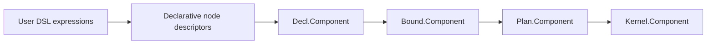
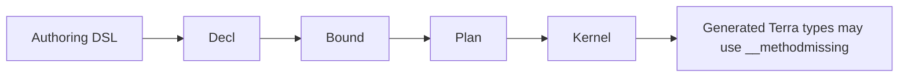

# TerraUI Authoring API

Status: draft v0.4  
Purpose: define the public user-facing API that lowers into `Decl`.

## Canonical lower layers

This document sits on top of:

- `docs/design/terraui.asdl`
- `docs/design/07-method-contracts.md`
- `docs/design/08-context-contracts.md`

It defines the surface that users write, and how that surface maps into the compiler IR.

## 1. Main design decision

For v1, TerraUI should expose a:

> declarative immediate-mode combinator DSL that lowers directly into `Decl`

This replaces the earlier callback-heavy builder direction.

## 2. Core syntax rule

The DSL should assign clear meaning to the two brace positions.

### First `{ ... }`
A **record/config table**.

Used for:
- node props
- leaf props
- widget props
- component spec records
- style/config payloads

### Second `{ ... }`
A **children sequence table**.

Used only on container-like combinators.

### Canonical forms

#### Leaves / widgets
```lua
label  { text = "Hello" }
button { id = stable "save", text = "Save", action = "save" }
```

#### Containers
```lua
row { gap = 8 } {
    label  { text = "A" },
    button { text = "B" },
}
```

#### Component
```lua
component "demo" {
    root = column { ... } { ... }
}
```

This is the semantic rule:

> first table = keyed record, second table = ordered child list.

## 3. Why this shape is preferred

It gives TerraUI a coherent Lua DSL:
- no callback noise for ordinary static structure
- no ambiguity about the role of braces
- props and children are visually distinct by position
- child order is explicit in the literal sequence
- the syntax still lowers naturally into `Decl`

## 4. High-level model



## 5. Public API layers

### 5.1 Layer 1 — structural combinators

These map closely to `Decl`:
- `component`
- `param`
- `state`
- `row`
- `column`
- `stack`
- `scroll_region`
- `tooltip`
- `label`
- `button`
- `image_view`
- `spacer`
- `custom`

### 5.2 Layer 2 — expression and value helpers

These construct `Decl.Expr` forms or typed helper values:
- `rgba`
- `vec2`
- `grow`
- `fixed`
- `percent`
- `pad`
- `border`
- `radius`
- `stable`
- `indexed`
- `theme`
- `env`
- `call`
- `select`
- etc.

### 5.3 Layer 3 — child fragment helpers

These make dynamic child generation possible inside the second brace:
- `each(...)`
- `when(...)`
- `maybe(...)`
- `fragment { ... }`

## 6. Canonical authoring style

Example:

```lua
local ui = terraui.dsl()

local component     = ui.component
local param         = ui.param
local state         = ui.state
local column        = ui.column
local row           = ui.row
local label         = ui.label
local button        = ui.button
local image_view    = ui.image_view
local scroll_region = ui.scroll_region

local stable        = ui.stable
local indexed       = ui.indexed
local grow          = ui.grow
local fixed         = ui.fixed
local pad           = ui.pad
local rgba          = ui.rgba
local types         = ui.types
```

Then:

```lua
local decl =
component "demo_inspector" {
    params = {
        param "preview_image" { type = types.image },
    },

    state = {
        state "scroll_y" { type = types.number, initial = 0 },
    },

    root =
        column {
            id = stable "root",
            width = grow(),
            height = grow(),
            background = rgba(0.07, 0.07, 0.09, 1.0),
        } {
            row {
                id = stable "toolbar",
                height = fixed(48),
                padding = pad(12, 10, 12, 10),
                gap = 10,
            } {
                label  { id = stable "title", text = "TerraUI Demo" },
                button { id = stable "btn_save",  text = "Save",  action = "save"  },
                button { id = stable "btn_build", text = "Build", action = "build" },
                button { id = stable "btn_run",   text = "Run",   action = "run"   },
            },

            row {
                id = stable "body",
                width = grow(),
                height = grow(),
            } {
                scroll_region {
                    id = stable "left_panel",
                    width = fixed(260),
                    height = grow(),
                    vertical = true,
                } {
                    each({1,2,3}, function(i)
                        return button {
                            id = indexed("asset_row", i),
                            text = "Asset " .. tostring(i),
                            action = "select_asset",
                        }
                    end),
                },

                column {
                    id = stable "right_panel",
                    width = grow(),
                    height = grow(),
                    padding = pad(16, 16, 16, 16),
                    gap = 12,
                } {
                    label { id = stable "panel_title", text = "Inspector" },

                    image_view {
                        id = stable "preview",
                        image = ui.param_ref "preview_image",
                        aspect_ratio = 16/9,
                        fit = ui.image_fit.contain,
                    },
                },
            },
        },
}
```

## 7. Component form

Canonical shape:

```lua
component "name" {
    params = { ... },
    state = { ... },
    root = ...,
}
```

### Required keys
- `root`

### Optional keys
- `params`
- `state`

### Lowering
This form constructs one `Decl.Component`.

## 8. Param and state declarations

## 8.1 Param declaration

Canonical form:

```lua
param "preview_image" { type = types.image }
param "title" { type = types.string, default = "Hello" }
```

### Lowering
- produces one `Decl.Param`
- can also serve as an authoring declaration item inside `params = { ... }`

## 8.2 State declaration

Canonical form:

```lua
state "scroll_y" { type = types.number, initial = 0 }
```

### Lowering
- produces one `Decl.StateSlot`

## 8.3 Param/state references

Expression helpers should remain available:

```lua
ui.param_ref "preview_image"
ui.state_ref "scroll_y"
```

These lower to:
- `Decl.ParamRef(name)`
- `Decl.StateRef(name)`

## 9. Structural combinators

## 9.1 Leaves

Leaves consume one props record and return a node descriptor.

Examples:
```lua
label { text = "Hello" }
button { text = "Save", action = "save" }
image_view { image = preview_image }
spacer { width = fixed(8) }
```

## 9.2 Containers

Containers consume a props record, then a children sequence.

Examples:
```lua
row { gap = 8 } {
    label { text = "A" },
    label { text = "B" },
}

column { padding = pad(16,16,16,16) } {
    ...
}
```

### Important rule
The second brace is always a child list, never another props record.

## 10. Child sequence semantics

A container child sequence may contain:
- node descriptors
- `nil`
- child fragments
- nested child lists/fragments produced by helpers

The builder must flatten these deterministically.

## 11. Dynamic child helpers

## 11.1 `each(xs, fn)`

Used for repeated children.

Example:

```lua
scroll_region { id = stable "left_panel" } {
    each(assets, function(asset, i)
        return button {
            id = indexed("asset_row", i),
            text = asset.name,
            action = "select_asset",
        }
    end),
}
```

### Contract
- iteration order must be deterministic
- `fn` must return node, fragment, list, or `nil`

## 11.2 `when(cond, child)`

Used for conditional children.

Example:

```lua
column { id = stable "root" } {
    label { text = "Header" },
    when(show_preview,
        image_view { image = preview }
    ),
}
```

## 11.3 `maybe(child)`

Simple nil-tolerant child wrapper.

## 11.4 `fragment { ... }`

Used for explicit child grouping in declarative form.

Example:

```lua
row { gap = 8 } {
    fragment {
        label { text = "A" },
        label { text = "B" },
    },
}
```

## 12. Expression/value helper shape

Helper families should stay expression-oriented and simple.

### Examples
```lua
stable "root"
indexed("asset_row", i)
rgba(0.1, 0.1, 0.12, 1.0)
pad(12, 10, 12, 10)
grow()
fixed(48)
percent(0.5)
call("to_string", count)
select(cond, yes, no)
```

### Rule
Use ordinary Lua function-call syntax for non-table data-producing helpers.

This keeps the brace meanings reserved for declarative records and child lists.

## 13. Widget sugar policy

Widgets remain sugar over ordinary node construction.

### Examples
- `label { ... }` -> node + text leaf
- `button { ... }` -> interactive node + text leaf + button defaults
- `image_view { ... }` -> node + image leaf
- `scroll_region { ... } { ... }` -> clipped container node
- `tooltip { ... } { ... }` -> floating container node

No new runtime widget kinds are introduced by the public syntax.

## 14. Identity policy

Identity helpers:

```lua
stable "name"
indexed("name", i)
```

These are preferred over raw string ids for clarity in the DSL.

Auto ids may still exist, but explicit stable/indexed ids should be the primary public style in v1 examples.

## 15. Error behavior

The authoring layer should fail early on:
- malformed component records
- missing `root`
- invalid param/state declarations
- duplicate param/state names
- duplicate stable ids after resolution
- invalid child entries in child lists
- invalid props keys in strict mode
- v1 leaf+children structural conflicts

## 16. Where `__methodmissing` fits

Following `terra-compiler-pattern.md`:
- the public authoring DSL itself does **not** need `__methodmissing`
- the DSL is just declarative capture lowering into `Decl`
- `__methodmissing` belongs later on generated Terra types when Terra syntax itself should trigger compile-time specialization

So the stack is:



## 17. Canonical syntax summary

### Leaves
```lua
label { ... }
button { ... }
image_view { ... }
```

### Containers
```lua
row { ... } { ... }
column { ... } { ... }
scroll_region { ... } { ... }
```

### Component
```lua
component "name" { ... }
```

### Child helpers
```lua
each(xs, fn)
when(cond, child)
maybe(child)
fragment { ... }
```

## 18. Design conclusion

The public TerraUI syntax should now be considered:

> leaves use one brace record, containers use record-then-children double braces.

This is the first authoring shape that is both Lua-idiomatic and semantically coherent enough to standardize.
