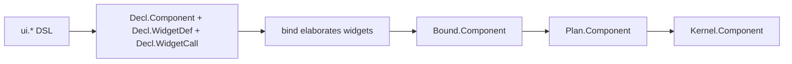

# TerraUI Authoring API

Status: implementation-aligned v0.5  
Purpose: define the public user-facing API that lowers into `Decl`.

## Canonical lower layers

This document sits on top of:

- `docs/design/terraui.asdl`
- `docs/design/07-method-contracts.md`
- `docs/design/08-context-contracts.md`
- `lib/dsl.t`
- `lib/terraui.t`

It defines the surface that users write, and how that surface maps into the compiler IR.

## 1. Current implementation snapshot

As of the current implementation, TerraUI ships a **capture-time declarative DSL** that lowers directly into `Decl.*` values.

Important clarification:

- the DSL is real and implemented
- child helpers such as `each`, `when`, `maybe`, and `fragment` operate at **capture time in Lua**, not as runtime dynamic node replication inside the kernel
- first-class widget definitions and widget calls now exist at the `Decl` layer
- widgets are **fully elaborated during bind**, so `Bound`, `Plan`, and `Kernel` stay widget-free and canonical
- the current public compile path is:

```text
Decl DSL -> bind -> plan -> compile -> Kernel.Component
```

The public entrypoint is:

```lua
local terraui = require("lib/terraui")
local ui = terraui.dsl()
```

## 2. Main design decision

For v1, TerraUI exposes a:

> declarative immediate-mode combinator DSL that lowers directly into `Decl`

This replaces the earlier callback-heavy builder direction.

## 3. Core syntax rule

The DSL assigns clear meaning to the two brace positions.

### First `{ ... }`
A **record/config table**.

Used for:
- node props
- leaf props
- widget props
- component spec records
- style/config payloads

### Second `{ ... }`
A **children sequence table**.

Used only on container-like combinators.

### Canonical forms

#### Leaves / widgets
```lua
ui.label  { text = "Hello" }
ui.button { id = ui.stable("save"), text = "Save", action = "save" }
```

#### Containers
```lua
ui.row { gap = 8 } {
    ui.label  { text = "A" },
    ui.button { text = "B" },
}
```

#### Component
```lua
ui.component("demo") {
    root = ui.column { ... } { ... }
}
```

Semantic rule:

> first table = keyed record, second table = ordered child list.

## 4. High-level model



## 5. Public API layers

### 5.1 Layer 1 — structural combinators

Implemented now:
- `component`
- `param`
- `state`
- `widget`
- `widget_prop`
- `widget_slot`
- `use`
- `slot`
- `row`
- `column`
- `stack` (currently alias of `column`)
- `scroll_region`
- `tooltip`
- `label`
- `button`
- `image_view`
- `spacer`
- `custom`

### 5.2 Layer 2 — expression and value helpers

Implemented now:
- `rgba`
- `vec2`
- `grow`
- `fit`
- `fixed`
- `percent`
- `pad`
- `border`
- `radius`
- `stable`
- `indexed`
- `theme`
- `env`
- `param_ref`
- `state_ref`
- `prop_ref`
- `call`
- `select`
- `num`
- `str`
- `bool`
- `as_expr`

### 5.3 Layer 3 — child fragment helpers

Implemented now:
- `each(xs, fn)`
- `when(cond, child)`
- `maybe(child)`
- `fragment { ... }`

### Important constraint

These helpers are **capture-time** helpers. They help build the authored `Decl` tree in Lua. They do **not** currently imply runtime-varying child counts inside the compiled kernel.

## 6. Canonical authoring style

```lua
local terraui = require("lib/terraui")
local ui = terraui.dsl()

local decl = ui.component("demo_inspector") {
    params = {
        ui.param("preview_image") { type = ui.types.image },
        ui.param("title") { type = ui.types.string, default = "Inspector" },
    },

    state = {
        ui.state("scroll_y") { type = ui.types.number, initial = 0 },
    },

    root = ui.column {
        id = ui.stable("root"),
        width = ui.grow(),
        height = ui.grow(),
        background = ui.rgba(0.07, 0.07, 0.09, 1.0),
        gap = 12,
    } {
        ui.row {
            id = ui.stable("toolbar"),
            height = ui.fixed(48),
            padding = ui.pad(12),
            gap = 10,
        } {
            ui.label  { id = ui.stable("title"), text = ui.param_ref("title") },
            ui.button { id = ui.stable("btn_save"),  text = "Save",  action = "save"  },
            ui.button { id = ui.stable("btn_build"), text = "Build", action = "build" },
        },

        ui.row {
            id = ui.stable("body"),
            width = ui.grow(),
            height = ui.grow(),
        } {
            ui.scroll_region {
                id = ui.stable("left_panel"),
                width = ui.fixed(260),
                height = ui.grow(),
                vertical = true,
                scroll_y = ui.state_ref("scroll_y"),
            } {
                ui.each({1,2,3}, function(i)
                    return ui.button {
                        id = ui.indexed("asset_row", i),
                        text = "Asset " .. tostring(i),
                        action = "select_asset",
                    }
                end),
            },

            ui.column {
                id = ui.stable("right_panel"),
                width = ui.grow(),
                height = ui.grow(),
                padding = ui.pad(16),
                gap = 12,
            } {
                ui.label { text = "Preview" },
                ui.image_view {
                    id = ui.stable("preview"),
                    image = ui.param_ref("preview_image"),
                    aspect_ratio = 16/9,
                    fit = ui.image_fit.contain,
                },
            },
        },
    },
}
```

## 7. Component form

Canonical shape:

```lua
ui.component("name") {
    params = { ... },
    state = { ... },
    widgets = { ... },
    root = ...,
}
```

### Required keys
- `root`

### Optional keys
- `params`
- `state`
- `widgets`

### Lowering
Produces `Decl.Component`.

## 8. Param, state, and widget declarations

### Param declaration
```lua
ui.param("preview_image") { type = ui.types.image }
ui.param("title") { type = ui.types.string, default = "Hello" }
```

Lowers to `Decl.Param`.

### State declaration
```lua
ui.state("scroll_y") { type = ui.types.number, initial = 0 }
```

Lowers to `Decl.StateSlot`.

### Param/state references
```lua
ui.param_ref("preview_image")
ui.state_ref("scroll_y")
```

Lower to:
- `Decl.ParamRef(name)`
- `Decl.StateRef(name)`

### Widget declarations and calls
```lua
local Card = ui.widget("Card") {
    props = {
        ui.widget_prop("title") { type = ui.types.string },
    },
    slots = {
        ui.widget_slot("children"),
    },
    root = ui.column { id = ui.stable("root") } {
        ui.label { id = ui.stable("title"), text = ui.prop_ref("title") },
        ui.slot("children"),
    },
}

ui.use("Card") { id = ui.stable("card1"), title = "Inspector" } {
    ui.label { text = "Body" },
}
```

Lowering notes:
- `ui.widget(...)` returns `Decl.WidgetDef`
- `ui.widget_prop(...)` returns `Decl.WidgetProp`
- `ui.widget_slot(...)` returns `Decl.WidgetSlot`
- `ui.use(...)` returns `Decl.WidgetCall`
- `ui.slot(name)` lowers to `Decl.SlotRef(name)` inside widget bodies
- `ui.prop_ref(name)` lowers to `Decl.WidgetPropRef(name)`
- widget calls are elaborated away during bind

## 9. Structural combinators

### Leaves
Implemented leaf/widget constructors:
- `ui.label { ... }`
- `ui.button { ... }`
- `ui.image_view { ... }`
- `ui.spacer { ... }`
- `ui.custom { ... }`

These return `Decl.Node` values with an appropriate `leaf` payload or no leaf for `spacer`.

### Containers
Implemented container constructors:
- `ui.row { ... } { ... }`
- `ui.column { ... } { ... }`
- `ui.stack { ... } { ... }`
- `ui.scroll_region { ... } { ... }`
- `ui.tooltip { ... } { ... }`

These return `Decl.Node` values with normalized child lists.

## 10. Child sequence semantics

A container child sequence may contain:
- a `Decl.Node`
- a `Decl.WidgetCall`
- a slot placeholder via `ui.slot(...)` when authoring a widget body
- `nil`
- `fragment`
- nested Lua arrays of valid child entries
- the result of `each`, `when`, or `maybe`

Flattening is deterministic and happens during DSL capture.

## 11. Current lowering notes for special combinators

### `scroll_region`
Current lowering:
- axis = `Column`
- width/height default to `grow()`
- `wheel = true` by default
- `horizontal`, `vertical`, `scroll_x`, `scroll_y` lower into `Decl.Clip`

### `tooltip`
Current lowering:
- axis = `Column`
- width/height default to `fit()`
- floating is only created if `target` / `float_target` is provided in props

### `stack`
Current status:
- implemented as an alias of `column`
- not yet a distinct layout mode

## 12. Widget policy

TerraUI now has two widget layers:

1. built-in DSL combinators such as `label`, `button`, `image_view`, `scroll_region`, and `tooltip`
2. user-authored first-class `Decl` widgets via `ui.widget(...)` and `ui.use(...)`

Important implementation rule:

> widgets are authoring-time constructs only. They are elaborated away during bind.

So:
- no widget nodes survive into `Bound`
- no widget side tables are added to `Plan`
- no widget runtime unions are added to `Kernel`

That preserves the canonical compiler spine while still giving widget authors typed props and named slots.

## 13. Identity policy

Preferred public identity helpers:

```lua
ui.stable("name")
ui.indexed("name", i)
```

Raw string ids also work in the current implementation and lower to stable ids.

## 14. Error behavior

The current DSL fails early on:
- missing required props for several built-in widgets (`label.text`, `button.text`, `image_view.image`, `custom.kind`)
- malformed component root
- invalid child entries
- invalid ids / size / padding inputs
- unknown widget names during bind
- duplicate widget names / prop names / slot names during bind
- missing required widget props during bind
- unknown or duplicate widget slot arguments during bind
- `ui.slot(...)` / `Decl.SlotRef(...)` used outside widget bodies during bind

Further strict-key validation is still future work.

## 15. Where `__methodmissing` fits

Per `terra-compiler-pattern.md`:
- the public authoring DSL does **not** use `__methodmissing`
- the DSL is plain Lua capture lowering into `Decl`
- `__methodmissing` remains a tool for generated Terra runtime/backend types when Terra syntax itself should trigger compile-time specialization

## 16. Public compile entry

The public entrypoint currently lives in:

- `lib/terraui.t`

Main functions:
- `terraui.dsl()`
- `terraui.bind(decl, opts)`
- `terraui.plan(bound)`
- `terraui.compile_plan(plan_component)`
- `terraui.compile(decl, opts)`

`terraui.compile(...)` runs the full pipeline and returns `Kernel.Component`.

## 17. Memoization note

The public compile entry is memoized.

Current implementation memoizes by a deterministic string derived from `Plan.Component.key`. That gives a stable public caching path without adding a custom heavyweight cache layer beyond Terra's own memoization machinery.

## 18. Design conclusion

The shipped v1 authoring surface is now:

> a capture-time declarative DSL where leaves use one props record, containers use props record plus child-list record, first-class widgets live in `Decl`, and bind elaborates widget calls back into canonical nodes before planning/compilation.
