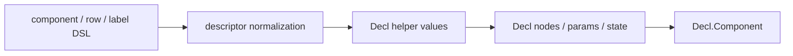

# TerraUI Builder API Reference

Status: draft v0.4  
Purpose: define the concrete public DSL/builders for TerraUI v1.

## Canonical companion docs

- `docs/design/09-authoring-api.md`
- `docs/design/terraui.asdl`
- `docs/design/07-method-contracts.md`

This document freezes the concrete public surface selected by the authoring API design.

## 1. Style summary

The DSL uses three main shapes:

### Component
```lua
component "name" { ... }
```

### Leaves / single-node widgets
```lua
label { ... }
button { ... }
image_view { ... }
```

### Containers
```lua
row { ... } { ... }
column { ... } { ... }
scroll_region { ... } { ... }
```

Semantic rule:
- first brace = props/config record
- second brace = children list

## 2. DSL environment

Recommended setup:

```lua
local ui = terraui.dsl()
```

The returned environment/table should expose:
- constructors/combinators
- helper namespaces
- value helpers
- child fragment helpers

## 3. Required exported bindings

## 3.1 Core constructors

```lua
ui.component
ui.param
ui.state

ui.row
ui.column
ui.stack
ui.scroll_region
ui.tooltip

ui.label
ui.button
ui.image_view
ui.spacer
ui.custom
```

## 3.2 Child fragment helpers

```lua
ui.each
ui.when
ui.maybe
ui.fragment
```

## 3.3 Identity/value helpers

```lua
ui.stable
ui.indexed
ui.rgba
ui.vec2
ui.fit
ui.grow
ui.fixed
ui.percent
ui.pad
ui.border
ui.radius
ui.call
ui.select
ui.theme
ui.env
ui.param_ref
ui.state_ref
```

## 3.4 Namespaces

```lua
ui.types
ui.axis
ui.align_x
ui.align_y
ui.wrap
ui.text_align
ui.image_fit
ui.pointer_capture
ui.attach
ui.float
```

## 4. Helper namespaces

## 4.1 `ui.types`

Required members:

```lua
ui.types.bool
ui.types.number
ui.types.string
ui.types.color
ui.types.image
ui.types.vec2
ui.types.any
```

## 4.2 `ui.axis`

```lua
ui.axis.row
ui.axis.column
```

## 4.3 `ui.align_x`

```lua
ui.align_x.left
ui.align_x.center
ui.align_x.right
```

## 4.4 `ui.align_y`

```lua
ui.align_y.top
ui.align_y.center
ui.align_y.bottom
```

## 4.5 `ui.wrap`

```lua
ui.wrap.words
ui.wrap.newlines
ui.wrap.none
```

## 4.6 `ui.text_align`

```lua
ui.text_align.left
ui.text_align.center
ui.text_align.right
```

## 4.7 `ui.image_fit`

```lua
ui.image_fit.stretch
ui.image_fit.contain
ui.image_fit.cover
```

## 4.8 `ui.pointer_capture`

```lua
ui.pointer_capture.capture
ui.pointer_capture.passthrough
```

## 4.9 `ui.attach`

```lua
ui.attach.left_top
ui.attach.top_center
ui.attach.right_top
ui.attach.left_center
ui.attach.center
ui.attach.right_center
ui.attach.left_bottom
ui.attach.bottom_center
ui.attach.right_bottom
```

## 4.10 `ui.float`

```lua
ui.float.parent
ui.float.by_id(id)
```

## 5. Component and declaration constructors

## 5.1 `component "name" { spec }`

### Form
```lua
component "name" {
    params = { ... },
    state = { ... },
    root = ...,
}
```

### Required fields in `spec`
- `root`

### Optional fields
- `params`
- `state`

### Lowering
Returns `Decl.Component`.

### Validation
- `name` must be non-empty
- `root` must be a valid node descriptor

## 5.2 `param "name" { ... }`

### Form
```lua
param "title" { type = ui.types.string, default = "Hello" }
```

### Required fields
- `type`

### Optional fields
- `default`

### Lowering
Returns a declaration item for `params = { ... }` and lowers to `Decl.Param`.

## 5.3 `state "name" { ... }`

### Form
```lua
state "scroll_y" { type = ui.types.number, initial = 0 }
```

### Required fields
- `type`

### Optional fields
- `initial`

### Lowering
Returns a declaration item for `state = { ... }` and lowers to `Decl.StateSlot`.

## 6. Leaf constructors

Leaf constructors consume one props record and return one node descriptor.

## 6.1 `label { props }`

### Props
- `id?`
- `text`
- `color?`
- `font_id?`
- `font_size?`
- `letter_spacing?`
- `line_height?`
- `wrap?`
- `text_align?`
- `width?`
- `height?`
- `padding?`
- `align_x?`
- `align_y?`
- `aspect_ratio?`
- `visible_when?`
- `enabled_when?`

### Lowering
Node + text leaf.

## 6.2 `button { props }`

### Props
- `id`
- `text`
- `action?`
- `cursor?`
- `width?`
- `height?`
- `padding?`
- `align_x?`
- `align_y?`
- `background?`
- `border?`
- `radius?`
- `opacity?`
- `text_color?`
- `font_id?`
- `font_size?`
- `visible_when?`
- `enabled_when?`
- `focus?`

### Lowering
Interactive node + text leaf + button defaults.

## 6.3 `image_view { props }`

### Props
- `id`
- `image`
- `fit?`
- `tint?`
- `aspect_ratio?`
- `width?`
- `height?`
- `padding?`
- `background?`
- `border?`
- `radius?`
- `opacity?`
- `visible_when?`
- `enabled_when?`

### Lowering
Node + image leaf.

## 6.4 `spacer { props }`

### Props
- `id?`
- `width?`
- `height?`

### Lowering
Structural node with no leaf.

## 6.5 `custom { props }`

### Props
- `id`
- `kind`
- `payload?`
- `width?`
- `height?`
- `aspect_ratio?`
- `padding?`
- `background?`
- `border?`
- `radius?`
- `opacity?`

### Lowering
Node + custom leaf.

## 7. Container constructors

Containers are two-stage combinators:

```lua
container { props } { children }
```

Stage 1 returns a callable/continuation awaiting a child list.

Stage 2 accepts one children list table.

## 7.1 Common container props

- `id?`
- `visible_when?`
- `enabled_when?`
- `width?`
- `height?`
- `padding?`
- `gap?`
- `align_x?`
- `align_y?`
- `background?`
- `border?`
- `radius?`
- `opacity?`
- `clip?`
- `floating?`
- `aspect_ratio?`
- `hover?`
- `press?`
- `focus?`
- `wheel?`
- `cursor?`
- `action?`

## 7.2 `row { props } { children }`

### Lowering
Node with `layout.axis = Row`.

## 7.3 `column { props } { children }`

### Lowering
Node with `layout.axis = Column`.

## 7.4 `stack { props } { children }`

### v1 status
Authoring sugar only.

### Lowering
Must lower to ordinary core node structure without extending the ASDL.

## 7.5 `scroll_region { props } { children }`

### Additional props
- `horizontal?`
- `vertical?`
- `scroll_x?`
- `scroll_y?`

### Lowering
Clipped container node.

### Lowering policy
- explicit `scroll_x` / `scroll_y` become clip child offsets
- runtime-managed scrolling remains compatible with the same clip structure

## 7.6 `tooltip { props } { children }`

### Additional props
- `target`
- `element_point?`
- `parent_point?`
- `offset_x?`
- `offset_y?`
- `expand_w?`
- `expand_h?`
- `z_index?`
- `pointer_capture?`

### Lowering
Floating container node.

## 8. Child list contract

The second table in a container call is always a child list.

Example:

```lua
row { gap = 8 } {
    label { text = "A" },
    label { text = "B" },
}
```

### Allowed entries
- node descriptor
- `nil`
- fragment
- result of `each(...)`
- result of `when(...)`
- nested fragment/list forms accepted by the builder implementation

### Not allowed
- keyed props records pretending to be children
- arbitrary non-node scalar values

## 9. Child fragment helpers

## 9.1 `each(xs, fn)`

### Form
```lua
each(xs, function(x, i) ... end)
```

### Returns
A fragment-like child producer.

### Contract
- iteration order must be deterministic
- `fn` may return node, fragment, list, or `nil`

## 9.2 `when(cond, child)`

### Form
```lua
when(cond, child)
```

### Returns
A fragment-like conditional child.

## 9.3 `maybe(child)`

### Form
```lua
maybe(child)
```

### Returns
`child` or empty fragment semantics.

## 9.4 `fragment { children }`

### Form
```lua
fragment {
    label { text = "A" },
    label { text = "B" },
}
```

### Returns
A flattenable child fragment.

## 10. Value helpers

These remain ordinary function-style helpers.

## 10.1 Identity helpers

```lua
stable "root"
indexed("asset_row", i)
```

## 10.2 Layout helpers

```lua
grow(min?, max?)
fit(min?, max?)
fixed(value)
percent(value)
pad(left, top, right, bottom)
```

## 10.3 Visual helpers

```lua
rgba(r, g, b, a)
vec2(x, y)
border {
    left = ...,
    top = ...,
    right = ...,
    bottom = ...,
    between_children = ...,
    color = ...,
}
radius(tl, tr, br, bl)
```

## 10.4 Expression helpers

```lua
call(fn, ...)
select(cond, yes, no)
theme(name)
env(name)
param_ref(name)
state_ref(name)
```

## 11. Defaulting rules

The implementation should define explicit defaults.

Recommended baseline defaults:
- `visible_when = nil`
- `enabled_when = nil`
- `gap = 0`
- `padding = pad(0, 0, 0, 0)`
- `align_x = ui.align_x.left`
- `align_y = ui.align_y.top`
- no decor unless widget/helper adds one
- no clip unless explicitly requested
- no floating unless explicitly requested
- interaction flags default false

Widget helpers may layer stronger defaults on top.

## 12. Lowering guarantees



The DSL implementation must guarantee:
1. deterministic child order
2. deterministic param/state order
3. deterministic id lowering
4. no hidden runtime widget kinds
5. container children are derived only from the second brace child list

## 13. Error contract

The DSL/builders should fail fast on:
- malformed component records
- missing required props
- duplicate param/state names
- invalid child entries
- malformed child fragments
- invalid percent values
- invalid ids
- duplicate stable ids after resolution
- v1 leaf+children conflicts

## 14. Canonical minimal surface

```lua
component "name" { ... }
param "name" { ... }
state "name" { ... }

row { ... } { ... }
column { ... } { ... }
stack { ... } { ... }
scroll_region { ... } { ... }
tooltip { ... } { ... }

label { ... }
button { ... }
image_view { ... }
spacer { ... }
custom { ... }

each(xs, fn)
when(cond, child)
maybe(child)
fragment { ... }

stable "id"
indexed("id", i)
grow(...)
fit(...)
fixed(...)
percent(...)
pad(...)
rgba(...)
vec2(...)
border { ... }
radius(...)
call(...)
select(...)
theme(...)
env(...)
param_ref(...)
state_ref(...)
```

## 15. Design conclusion

The builder/reference surface should now be considered standardized around:

> leaves use one props record, containers use props record followed by child-list record.

That is the canonical TerraUI v1 public syntax.
