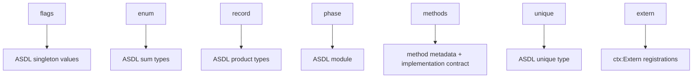
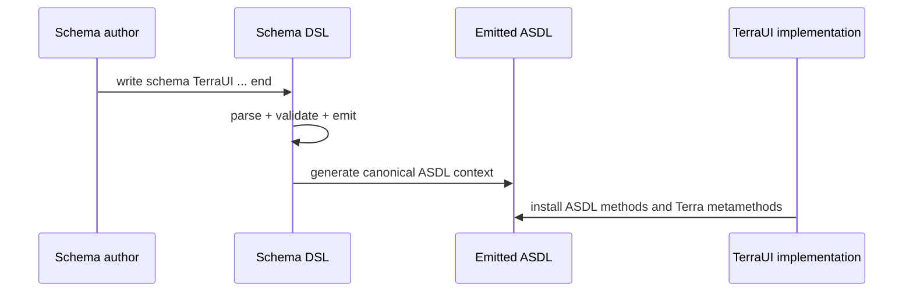

# TerraUI Schema DSL

Status: draft v0.3  
Purpose: define the schema-DSL layer that can author, validate, and emit `docs/design/terraui.asdl`.

## Canonical companions

- `docs/design/terraui.asdl`
- `docs/design/06-validation-rules.md`
- `docs/design/07-method-contracts.md`
- `terra-compiler-pattern.md`

This document specifies the higher-level schema language that should generate the canonical TerraUI ASDL and enforce the associated validation rules.

## 1. Why a schema DSL exists

Per `terra-compiler-pattern.md`, raw ASDL strings are powerful but too weak as an authoring surface for a serious compiler project.

Problems with raw ASDL alone:
- structural errors are caught too late
- constraints like `0 <= percent <= 1` are not expressed directly
- phase discipline is implicit rather than validated
- method declarations exist, but method-surface validation is not automatic
- error reporting is worse than a first-class language extension

The schema DSL exists to solve exactly that.

## 2. Design goal

The DSL should let us write:
- typed records
- enums/flags/sum types
- phases/modules
- extern declarations
- constraints
- defaults
- `unique`
- method declarations

and compile that into:
- ASDL definitions
- constructor validators
- method declaration metadata
- phase-order metadata
- Terra-native error messages

## 3. Position in the pipeline

```mermaid
flowchart LR
    A[Schema DSL source] --> B[Schema parser]
    B --> C[Schema validator]
    C --> D[ASDL emitter]
    D --> E[asdl.NewContext():Define(...)]
    E --> F[TerraUI compiler implementation]
```

## 4. Host mechanism

Following `terra-compiler-pattern.md`, the schema DSL should be implemented as a Terra language extension.

That means it provides:
- `name`
- `entrypoints`
- reserved keywords
- parser functions
- Terra-style error reporting through the lexer

## 5. Entry point

Recommended entry keyword:

```lua
schema
```

Example:

```lua
import "lib/schema"

schema TerraUI
    ...
end
```

## 6. DSL surface

The DSL should support these top-level constructs:
- `extern`
- `phase`
- `record`
- `enum`
- `flags`
- `methods`
- `unique`

## 7. Proposed grammar shape

This is not a parser-implementation grammar, but a design grammar.

```text
schema NAME
    extern ...
    phase NAME
        record ...
        enum ...
        flags ...
        methods ...
    end
end
```

## 8. Core constructs

## 8.1 `extern`

Declares external checker-backed types used in the emitted ASDL.

Example:

```lua
extern TerraType  = terralib.types.istype
extern TerraQuote = terralib.isquote
extern BindCtx    = is_bind_ctx
extern PlanCtx    = is_plan_ctx
extern CompileCtx = is_compile_ctx
```

### Emits
Equivalent `ctx:Extern(...)` calls before `ctx:Define(...)`.

## 8.2 `phase`

Defines one phase/module in the compiler pipeline.

Example:

```lua
phase Decl
    ...
end
```

### Rule
Phase declaration order is semantic order.

For TerraUI the required order is:

```text
Decl -> Bound -> Plan -> Kernel
```

## 8.3 `record`

Defines a product type.

Example:

```lua
record Layout
    axis: Axis
    width: Size
    height: Size
    padding: Padding
    gap: Expr
    align_x: AlignX
    align_y: AlignY
end
```

### Supports
- required fields
- optional fields via `?`
- list fields via `*`
- default values
- constraints
- `unique`

## 8.4 `enum`

Defines a sum type.

Example:

```lua
enum Size
    Fit     { min: Value?, max: Value? }
    Grow    { min: Value?, max: Value? }
    Fixed   { value: Value }
    Percent { value: Value }
end
```

### Rule
Use `enum` for real tagged variants, not for singleton constants.

## 8.5 `flags`

Defines a singleton-value enum / symbolic constant set.

Example:

```lua
flags Axis
    Row
    Column
end
```

This should emit to ASDL singleton values.

## 8.6 `methods`

Declares the method surface associated with a phase or type set.

This is critical, because ASDL methods are part of the schema contract in TerraUI.

Example:

```lua
methods
    Component:bind(ctx: BindCtx) -> Bound.Component
    Node:bind(ctx: BindCtx) -> Bound.Node
    Expr:bind(ctx: BindCtx) -> Bound.Value
end
```

### Rule
Method declarations must be preserved as metadata and validated against implementation.

## 8.7 `unique`

Marks a record type as identity-canonicalized by structural equality.

Example:

```lua
record Component
    name: string
    params: Param*
    state: StateSlot*
    root: Node
unique
end
```

### Rule
Use only where structural identity materially benefits memoization or equality semantics.

## 9. Field syntax

Recommended field forms:

```text
name: Type
name: Type?
name: Type*
name: Type = default
name: number, 0 <= name <= 1
```

The schema DSL should support at least:
- optionality
- list multiplicity
- defaults
- constraints

## 10. Method declaration syntax

The DSL should support explicit method signatures, because TerraUI depends on them.

Recommended canonical form:

```lua
methods
    TypeName:method_name(arg: Type, arg2: Type) -> ReturnType
end
```

Examples:

```lua
methods
    Component:bind(ctx: BindCtx) -> Bound.Component
    Node:plan(ctx: PlanCtx, parent_index: number) -> number
    Component:compile(ctx: CompileCtx) -> Kernel.Component
end
```

## 11. TerraUI schema in DSL form

The following is a representative sketch, not the entire canonical source, of how TerraUI should look in the schema DSL.

```lua
schema TerraUI

    extern TerraType  = terralib.types.istype
    extern TerraQuote = terralib.isquote
    extern BindCtx    = is_bind_ctx
    extern PlanCtx    = is_plan_ctx
    extern CompileCtx = is_compile_ctx

    phase Decl
        flags ValueType
            TBool
            TNumber
            TString
            TColor
            TImage
            TVec2
            TAny
        end

        flags Axis
            Row
            Column
        end

        flags AlignX
            AlignLeft
            AlignCenterX
            AlignRight
        end

        flags AlignY
            AlignTop
            AlignCenterY
            AlignBottom
        end

        enum Id
            Auto {}
            Stable  { name: string }
            Indexed { name: string, index: Expr }
        end

        enum Size
            Fit     { min: Expr?, max: Expr? }
            Grow    { min: Expr?, max: Expr? }
            Fixed   { value: Expr }
            Percent { value: Expr, 0 <= value <= 1 }
        end

        record Component
            name: string
            params: Param*
            state: StateSlot*
            root: Node
        unique
        end

        methods
            Component:bind(ctx: BindCtx) -> Bound.Component
            Param:bind(ctx: BindCtx) -> Bound.Param
            StateSlot:bind(ctx: BindCtx) -> Bound.StateSlot
            Node:bind(ctx: BindCtx) -> Bound.Node
            Expr:bind(ctx: BindCtx) -> Bound.Value
        end
    end

    phase Bound
        ...
    end

    phase Plan
        ...
    end

    phase Kernel
        ...
    end

end
```

The fully authoritative emitted target remains `docs/design/terraui.asdl`.

## 12. Emission rules

The DSL compiler should emit three things.

## 12.1 ASDL definition text

This becomes the canonical string passed to `ctx:Define(...)`.

## 12.2 Extern registrations

Each `extern` becomes a `ctx:Extern(...)` registration.

## 12.3 Validation/install hooks

The schema layer should also install:
- constructor wrappers for constraints/default checking
- method declaration metadata
- parent fallback traps for missing method implementations where useful

## 13. Validation responsibilities of the DSL

The schema DSL is where many of the rules from `06-validation-rules.md` should be enforced.

## 13.1 Structural validation

- unknown type references
- invalid recursion without `*` or `?`
- one-variant enums that should be records
- duplicate field names
- duplicate variant names
- invalid phase ordering
- backward method returns
- forbidden sum types in final `Kernel` phase

## 13.2 Constraint validation

- numeric bounds parse correctly
- defaults match declared type
- constant constraints are valid

## 13.3 Method validation

- declared method receiver exists
- declared return type exists
- declared argument types exist
- declared method respects phase order
- metadata is preserved for later implementation checks

## 14. Relationship to method declarations

This is especially important for TerraUI.

The DSL should not merely emit ASDL types and forget methods.

It must treat method declarations as first-class schema data because:
- `docs/design/07-method-contracts.md` depends on them
- validators depend on them
- parent-before-child ordering discipline depends on them
- implementation completeness checks depend on them

## 15. Relationship to exotype metamethods

Per `terra-compiler-pattern.md`, the schema DSL should describe:
- ASDL types
- phase methods
- constraints

It should **not** try to encode Terra exotype metamethod implementations directly.

Those belong in implementation code over generated Terra structs/types.

So the split is:
- schema DSL: type and method contract surface
- implementation: ASDL methods + Terra metamethods

## 16. Error reporting contract

One of the biggest reasons to build the DSL is Terra-native errors.

The DSL should report errors via the Terra lexer, so messages look like ordinary Terra compiler errors.

## 16.1 Desired format

```text
my_schema.t:42: record 'Node' field 'aspect_ratio' must be > 0 when constant
my_schema.t:87: method 'compile' on Plan.Component returns Decl.Node, which violates phase order
my_schema.t:113: final phase 'Kernel' may not contain sum type 'RuntimeValue'
```

## 17. Parser expectations

Following `terra-compiler-pattern.md`, the DSL implementation should use:
- Terra language extension API
- Terra lexer hooks
- Pratt parser support for constraint expressions

Especially for:
- `0 <= value <= 1`
- default expressions
- optional future field annotations

## 18. Determinism requirements

The schema DSL compiler itself must be deterministic.

Given the same schema input, it must produce the same:
- extern registrations
- emitted ASDL text
- method metadata
- validation decisions

This matters because the downstream compiler relies on deterministic specialization and memoized compilation.

## 19. Schema DSL to ASDL mapping



## 20. Recommended implementation plan

1. parse externs, phases, records, enums, flags, methods, unique
2. build internal schema IR
3. run structural validation
4. emit ASDL text
5. register externs
6. call `ctx:Define(...)`
7. install constructor validators and method metadata

## 21. Non-goals for v1

The schema DSL does not need, initially, to solve:
- full code generation of method bodies
- backend implementation generation
- automatic exotype metamethod generation
- every possible sugar form

Its v1 job is narrower:

> make the TerraUI compiler schema explicit, validated, and ergonomically maintainable.

## 22. Canonical outcome

The implementation currently lives in:

- `lib/schema.t` — schema DSL language extension
- `lib/terraui_schema.t` — TerraUI schema written in the DSL
- `tools/emit_terraui_asdl.t` — emitted raw-ASDL inspection/check tool

The intended workflow is:



## 23. Design conclusion

The schema DSL should be treated as:
- a Terra language extension
- a validator for the TerraUI compiler schema
- an emitter of the canonical `terraui.asdl`
- a keeper of method declaration metadata

That is fully aligned with the pattern described in `terra-compiler-pattern.md`.
