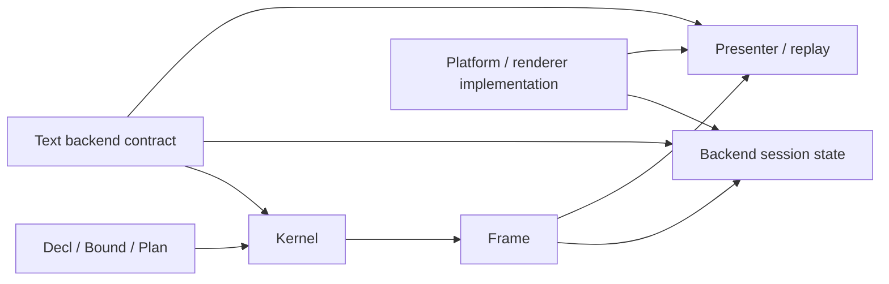
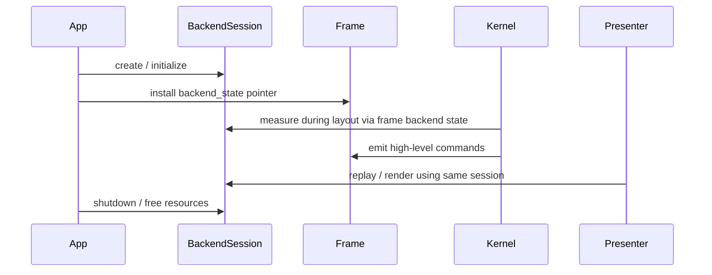
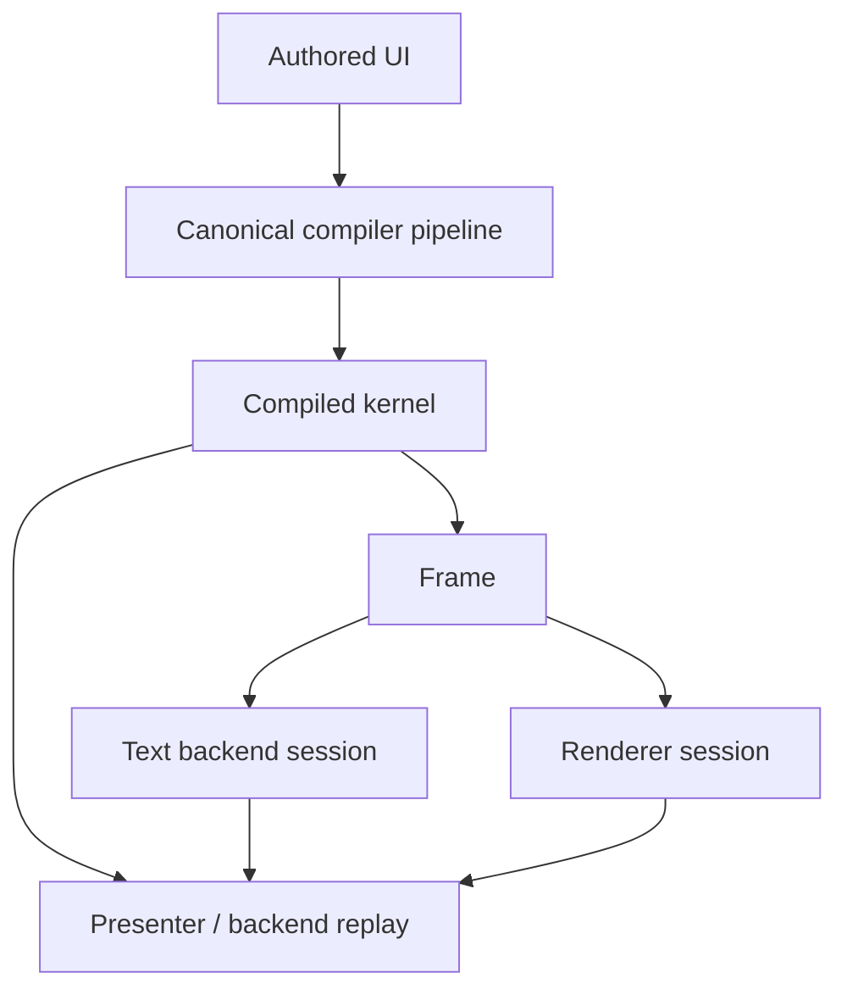

# TerraUI Backend Contracts

Status: draft v0.1  
Purpose: define the backend/session contract that sits below TerraUI's canonical IR and above concrete runtime implementations.

## 1. Why this document exists

TerraUI now has a clear split between:
- library semantics
- backend capability
- backend-owned runtime state

This document defines that split explicitly so TerraUI can swap SDL-based runtime pieces out later without changing the authored API or the canonical compiler pipeline.

## 2. Core rule

Backend contracts must expose:
- capability
- identity
- lifetime ownership

They must **not** expose:
- cache objects as public API
- ad hoc global state requirements
- backend-specific resource details in `Decl`, `Bound`, `Plan`, or `Kernel`

In other words:
- TerraUI owns semantics
- backends own resources
- caches remain private implementation detail inside backend sessions

## 3. Separation of concerns



## 4. What TerraUI owns

The canonical pipeline owns:
- layout semantics
- hit testing semantics
- clip semantics
- draw ordering semantics
- text wrap/alignment semantics
- height-for-width text layout contract
- high-level command stream structure

These are library semantics and must not depend on SDL, OpenGL, or any other single implementation.

## 5. What a backend owns

A backend owns:
- measurement implementation
- rendering/replay implementation
- platform/window/input integration outside the compiled frame contract
- runtime resources such as fonts, textures, atlases, and custom renderer state
- private caches used to make those resources efficient

## 6. Compile-time backend identity

Backend identity affects specialization.

That means the backend contract must expose a stable key, for example:

```lua
text_backend = {
    key = "sdl-ttf:/path/to/font",
    ...
}
```

This key belongs in specialization identity because different backend measurement behavior may change:
- intrinsic widths
- wrapped heights
- final layout

### Rule

If two backends can produce different layout results, they must not share one compiled kernel specialization.

## 7. Runtime backend session

A backend may require runtime-owned state.

TerraUI therefore exposes runtime session attachment through the frame, not through the authored API.

Current implemented shape:
- `frame.text_backend_state : &opaque`

This pointer is the ownership seam.
It allows the generated kernel to call backend measurement functions against session-owned resources without forcing those resources into the canonical IR.

## 8. Lifetime model



### Design rule

The app or runtime host owns backend session lifetime.

TerraUI must only assume:
- a valid session pointer is installed when a backend requires one
- a nil pointer means the backend cannot measure/render through session state

TerraUI must not own backend resource destruction policy directly.

## 9. Text backend contract

The most mature backend seam today is text.

### Compile-time/backend surface

```lua
text_backend = {
    key = string,

    measure_width = function(self, ctx, text_spec) -> TerraQuote end,
    measure_height_for_width = function(self, ctx, text_spec, max_width_q) -> TerraQuote end,
}
```

### Required behavior

`measure_width(...)` must:
- measure max-content width for the text spec
- respect backend font metrics and explicit line breaks
- return a quote usable in compiled layout code

`measure_height_for_width(...)` must:
- measure final text height for a concrete width constraint
- respect wrap mode and alignment-related backend constraints
- return a quote usable in compiled layout code

### Must guarantee

- equal backend key + equal session semantics -> equal layout behavior
- measurement may depend on `frame.text_backend_state`
- text shaping still remains outside the kernel in v1

## 10. Presenter / replay contract

The kernel emits high-level typed command streams.
The backend/presenter consumes them.

Backend replay owns:
- scissor state interpretation
- text rasterization/shaping policy
- image submission policy
- custom command dispatch

TerraUI owns:
- command ordering contract
- command field semantics
- subtree clip bracketing semantics

### Ordering rule

All backends must preserve TerraUI's command ordering rule:
- primary sort by `z`
- secondary sort by `seq`

## 11. Why cache is not part of the public contract

Cache is not the architectural concept.

The architectural concept is:
- owned backend session state

A backend session may privately contain:
- font caches
- measurement caches
- glyph atlases
- text texture caches
- image upload caches

But TerraUI should only talk about:
- backend identity
- backend lifetime
- backend capability

If a cache had to become part of the public API, that would indicate a lifetime leak in the design.

## 12. Current implemented state

### Implemented now
- text backend identity participates in specialization through the existing bound specialization key
- compile-time text measurement delegates through `CompileCtx.text_backend`
- runtime frame carries `text_backend_state`
- SDL demo owns a concrete `TextBackendSession`
- SDL demo uses the same owned session for measurement and rendering

### Still future / broader contract work
- unify image/custom backend state under a broader renderer session if needed
- formalize non-text backend session attachment if more runtime-owned services appear
- factor a full renderer backend contract distinct from the text backend contract

## 13. Recommended long-term shape



This is intentionally broader than the current implementation, but it preserves the same core rule:

> backend sessions own runtime resources; TerraUI only depends on stable capability and semantic behavior.

## 14. Non-goals

This document does **not** require:
- a single giant backend object today
- exposing cache APIs publicly
- moving authored semantics into backend code
- embedding backend resource handles into the canonical IR

## 15. Practical guidance

When adding or changing backend seams:
1. start from the canonical ASDL semantics
2. decide whether the change affects specialization identity
3. decide whether the backend needs runtime-owned session state
4. expose capability and lifetime, not cache policy
5. keep the canonical IR free of backend resource details
