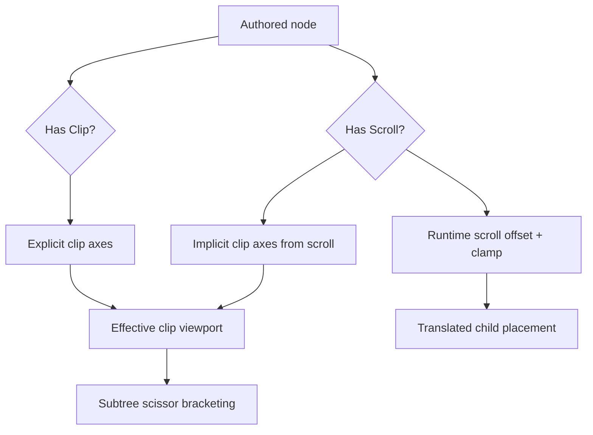
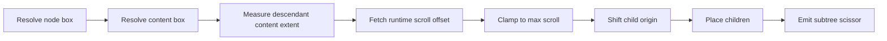
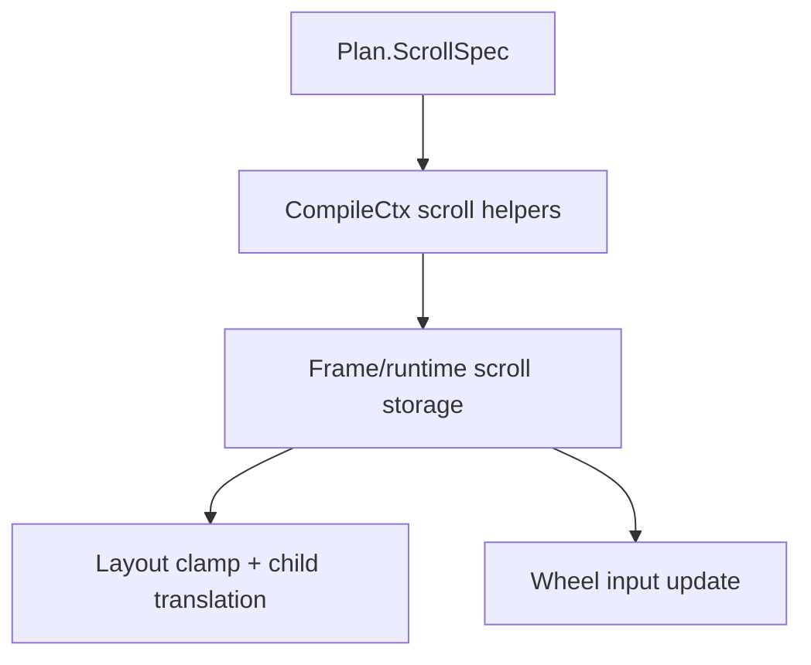

# TerraUI Scroll and Scroll-Area Redesign

Status: implemented scroll-core + widget follow-on v0.2  
Implementation status: structural `Clip`, first-class `Scroll`, runtime scroll metrics, thumb drag controls, and a standard-library `ui.scroll_area` widget are implemented. The remaining design work is about refining the standard widget surface, not reintroducing clip child offsets.

## 1. Why this proposal exists

The current design mixes two different concepts:

- **clipping** — constraining descendant visibility to a viewport
- **scrolling** — translating descendant content through a viewport using runtime-managed offsets

Today, the canonical docs and current DSL shape still carry the older mixed model:

- `Decl.Clip(horizontal, vertical, child_offset_x, child_offset_y)`
- `ui.scroll_region { scroll_x = ..., scroll_y = ... }`
- context docs that already say real scroll offsets belong in runtime state

That is conceptually unstable.

A clipped panel is not necessarily a scroll area, and a scroll area is not merely a clip with authored child offsets.

## 2. Design goals

1. Keep **clip** structural and narrow.
2. Make **scroll** a first-class authored and planned concept.
3. Keep runtime scroll offsets in runtime state, not authored expressions.
4. Preserve the canonical compiler spine: `Decl -> Bound -> Plan -> Kernel`.
5. Keep `Kernel` monomorphic.
6. Keep scissor / subtree clip bracketing attached to clip semantics.
7. Let `ui.scroll_region(...)` remain ergonomic while lowering honestly.

## 3. Core model

## 3.1 Clip

`Clip` means only:

- clip descendants horizontally and/or vertically to the node's content box
- emit subtree-scoped scissor begin/end
- affect hit testing through effective clip bounds

It does **not** own content translation.

## 3.2 Scroll

`Scroll` means:

- the node is a viewport over a larger descendant content extent
- runtime state supplies current `scroll_x` / `scroll_y`
- compile-time logic clamps offsets against computed content extents
- child placement is translated by those offsets
- wheel routing may update those runtime offsets

## 3.3 Relationship between them

A scroll area implies clipping on the scroll-enabled axes.

So the effective clip for a node is:

- explicit clip axes from `Decl.Clip`
- plus implicit clip axes from `Decl.Scroll`

This keeps scissor semantics centralized while letting scroll remain a separate behavioral feature.



## 4. Layout semantics

## 4.1 Viewport size vs content extent

A scroll area must distinguish:

- **viewport size** — the node's actual content box
- **content extent** — the laid out size of its descendant flow content before scroll translation

That distinction is necessary for:

- max-scroll computation
- offset clamping
- future scrollbar geometry
- answering whether scrolling is needed

## 4.2 Sizing rules

A scroll node still uses the ordinary size rules for its own box.

Examples:

- `height = fixed(300)` means a 300px viewport
- `height = grow()` means fill available height
- `height = fit()` means fit to content, so scrolling on that axis is usually unnecessary

`Fit` remains honest: it still means fit content, not "create an arbitrarily small scroll viewport".

## 4.3 Child placement rule

The intended rule is:

1. lay out the node box
2. compute content box
3. compute unclamped descendant content extent
4. fetch runtime scroll offsets
5. clamp offsets to valid range
6. translate child placement origin by `-scroll_x` / `-scroll_y`
7. emit subtree clip/scissor using the viewport



## 5. Input semantics

The deepest hovered enabled scroll node that supports a wheel-relevant axis should receive wheel scrolling first.

That logic belongs to scroll semantics, not generic node input semantics.

So:

- generic `InputSpec.wheel` may still exist for other future wheel-aware widgets
- but scroll motion is a separate kernel concern tied to `ScrollSpec`

## 6. Proposed ASDL changes

These are **proposed diffs**, not yet applied to the implementation schema.

## 6.1 `docs/design/terraui.asdl`

### Decl phase

Replace:

```asdl
Node = (
    Decl.Id id,
    Decl.Visibility visibility,
    Decl.Layout layout,
    Decl.Decor decor,
    Decl.Clip? clip,
    Decl.Floating? floating,
    Decl.Input input,
    Decl.Expr? aspect_ratio,
    Decl.Leaf? leaf,
    Decl.Child* children
)
```

with:

```asdl
Node = (
    Decl.Id id,
    Decl.Visibility visibility,
    Decl.Layout layout,
    Decl.Decor decor,
    Decl.Clip? clip,
    Decl.Scroll? scroll,
    Decl.Floating? floating,
    Decl.Input input,
    Decl.Expr? aspect_ratio,
    Decl.Leaf? leaf,
    Decl.Child* children
)
```

Replace:

```asdl
Clip = (
    boolean horizontal,
    boolean vertical,
    Decl.Expr? child_offset_x,
    Decl.Expr? child_offset_y
)
methods {
    bind(BindCtx ctx) -> Bound.Clip
}
```

with:

```asdl
Clip = (
    boolean horizontal,
    boolean vertical
)
methods {
    bind(BindCtx ctx) -> Bound.Clip
}

Scroll = (
    boolean horizontal,
    boolean vertical
)
methods {
    bind(BindCtx ctx) -> Bound.Scroll
}
```

### Bound phase

Replace:

```asdl
Node = (
    number local_id,
    Bound.ResolvedId stable_id,
    Bound.Visibility visibility,
    Bound.Layout layout,
    Bound.Decor decor,
    Bound.Clip? clip,
    Bound.Floating? floating,
    Bound.Input input,
    Bound.Value? aspect_ratio,
    Bound.Leaf? leaf,
    Bound.Node* children
)
```

with:

```asdl
Node = (
    number local_id,
    Bound.ResolvedId stable_id,
    Bound.Visibility visibility,
    Bound.Layout layout,
    Bound.Decor decor,
    Bound.Clip? clip,
    Bound.Scroll? scroll,
    Bound.Floating? floating,
    Bound.Input input,
    Bound.Value? aspect_ratio,
    Bound.Leaf? leaf,
    Bound.Node* children
)
```

Replace:

```asdl
Clip = (
    boolean horizontal,
    boolean vertical,
    Bound.Value? child_offset_x,
    Bound.Value? child_offset_y
)
methods {
    plan(PlanCtx ctx, number node_index) -> number
}
```

with:

```asdl
Clip = (
    boolean horizontal,
    boolean vertical
)
methods {
    plan(PlanCtx ctx, number node_index) -> number
}

Scroll = (
    boolean horizontal,
    boolean vertical
)
methods {
    plan(PlanCtx ctx, number node_index) -> number
}
```

Add method declaration:

```asdl
Scroll:plan(PlanCtx ctx, number node_index) -> number
```

### Plan phase

Replace:

```asdl
Component = (
    Bound.SpecializationKey key,
    Plan.Node* nodes,
    Plan.Guard* guards,
    Plan.Paint* paints,
    Plan.InputSpec* inputs,
    Plan.ClipSpec* clips,
    Plan.TextSpec* texts,
    Plan.ImageSpec* images,
    Plan.CustomSpec* customs,
    Plan.FloatSpec* floats,
    number root_index
) unique
```

with:

```asdl
Component = (
    Bound.SpecializationKey key,
    Plan.Node* nodes,
    Plan.Guard* guards,
    Plan.Paint* paints,
    Plan.InputSpec* inputs,
    Plan.ClipSpec* clips,
    Plan.ScrollSpec* scrolls,
    Plan.TextSpec* texts,
    Plan.ImageSpec* images,
    Plan.CustomSpec* customs,
    Plan.FloatSpec* floats,
    number root_index
) unique
```

Replace:

```asdl
Node = (
    number index,
    number? parent,
    number? first_child,
    number child_count,
    number subtree_end,

    Decl.Axis axis,
    Plan.SizeRule width,
    Plan.SizeRule height,
    Plan.Binding padding_left,
    Plan.Binding padding_top,
    Plan.Binding padding_right,
    Plan.Binding padding_bottom,
    Plan.Binding gap,
    Decl.AlignX align_x,
    Decl.AlignY align_y,

    number guard_slot,
    number paint_slot,
    number input_slot,
    number? clip_slot,
    number? text_slot,
    number? image_slot,
    number? custom_slot,
    number? float_slot,

    Plan.Binding? aspect_ratio
)
```

with:

```asdl
Node = (
    number index,
    number? parent,
    number? first_child,
    number child_count,
    number subtree_end,

    Decl.Axis axis,
    Plan.SizeRule width,
    Plan.SizeRule height,
    Plan.Binding padding_left,
    Plan.Binding padding_top,
    Plan.Binding padding_right,
    Plan.Binding padding_bottom,
    Plan.Binding gap,
    Decl.AlignX align_x,
    Decl.AlignY align_y,

    number guard_slot,
    number paint_slot,
    number input_slot,
    number? clip_slot,
    number? scroll_slot,
    number? text_slot,
    number? image_slot,
    number? custom_slot,
    number? float_slot,

    Plan.Binding? aspect_ratio
)
```

Replace:

```asdl
ClipSpec = (
    number node_index,
    boolean horizontal,
    boolean vertical,
    Plan.Binding? child_offset_x,
    Plan.Binding? child_offset_y
)
methods {
    compile_apply(CompileCtx ctx) -> TerraQuote
    compile_emit_begin(CompileCtx ctx) -> TerraQuote
    compile_emit_end(CompileCtx ctx) -> TerraQuote
}
```

with:

```asdl
ClipSpec = (
    number node_index,
    boolean horizontal,
    boolean vertical
)
methods {
    compile_apply(CompileCtx ctx) -> TerraQuote
    compile_emit_begin(CompileCtx ctx) -> TerraQuote
    compile_emit_end(CompileCtx ctx) -> TerraQuote
}

ScrollSpec = (
    number node_index,
    boolean horizontal,
    boolean vertical
)
methods {
    compile_apply(CompileCtx ctx) -> TerraQuote
    compile_input(CompileCtx ctx) -> TerraQuote
}
```

Add method declarations:

```asdl
ScrollSpec:compile_apply(CompileCtx ctx) -> TerraQuote
ScrollSpec:compile_input(CompileCtx ctx) -> TerraQuote
```

## 6.2 Runtime consequences outside ASDL

The ASDL change is not sufficient by itself. The runtime layout contract will also need explicit scroll-related data, either in `NodeState` or in backend/runtime-owned storage:

- `content_extent_w`
- `content_extent_h`
- runtime `scroll_x`
- runtime `scroll_y`
- possibly cached `max_scroll_x`
- possibly cached `max_scroll_y`

Exact storage location is still a design choice, but the semantic data is required.

## 7. Proposed method-contract changes

## 7.1 Decl / Bound

### `Decl.Clip:bind(BindCtx) -> Bound.Clip`
New contract:
- preserve only horizontal/vertical structural clip flags
- do not bind child offsets

### `Decl.Scroll:bind(BindCtx) -> Bound.Scroll`
New contract:
- preserve authored scroll-enabled axes
- no runtime offsets are bound from authored expressions

### `Bound.Clip:plan(PlanCtx, node_index) -> number`
New contract:
- emit only explicit clip structure

### `Bound.Scroll:plan(PlanCtx, node_index) -> number`
New contract:
- allocate a `Plan.ScrollSpec`
- no scissor commands are owned here directly

## 7.2 Plan

### `Plan.ClipSpec:compile_apply(CompileCtx) -> TerraQuote`
Revised contract:
- intersect effective viewport clip bounds
- no longer translate child/content origin

### `Plan.ScrollSpec:compile_apply(CompileCtx) -> TerraQuote`
New contract:
- fetch runtime scroll offsets
- clamp offsets against computed content extent
- shift child placement origin for enabled axes
- expose clamped offsets for downstream logic if needed

### `Plan.ScrollSpec:compile_input(CompileCtx) -> TerraQuote`
New contract:
- consume wheel input for the deepest eligible hovered scroll node
- update runtime scroll offsets deterministically
- clamp after update

## 8. Proposed context-contract changes

The current context docs already mention optional scroll helpers. Under this redesign they stop being vague extras and become part of the expected scroll contract.

## 8.1 CompileCtx helpers

Expected helpers remain:

- `get_scroll_offset_x(frame_q, node_index)`
- `get_scroll_offset_y(frame_q, node_index)`
- `set_scroll_offset_x(frame_q, node_index, value_q)`
- `set_scroll_offset_y(frame_q, node_index, value_q)`

Likely additions:

- `get_scroll_extent_w(frame_q, node_index)` or equivalent storage contract
- `get_scroll_extent_h(frame_q, node_index)`
- `set_scroll_extent_w(frame_q, node_index, value_q)`
- `set_scroll_extent_h(frame_q, node_index, value_q)`

If extents are stored in node runtime state instead, these helpers may not be needed. But the contract must name where extents live.

## 8.2 Scroll state type

`Kernel.RuntimeTypes.scroll_state_t` becomes meaningful rather than placeholder-only.



## 9. Proposed authoring API changes

## 9.1 `ui.scroll_region`

Keep the combinator, but change its lowering.

Current shape to retire:

```lua
ui.scroll_region {
    vertical = true,
    scroll_y = ui.state_ref("scroll_y"),
}
```

Proposed shape:

```lua
ui.scroll_region {
    horizontal = false,
    vertical = true,
}
```

Lowering target:

- `Decl.Scroll(horizontal, vertical)`
- implicit clip on the same axes
- no public authored offset expressions

## 9.2 Programmatic scroll control

Programmatic scroll control should be designed later as a runtime/control API, not encoded as authored layout expressions.

That future surface might look like:

- host-side frame/session API
- command-style action output
- imperative runtime setters keyed by node index or stable ref

But it should **not** be part of `Decl.Scroll` itself.

## 10. Validation rules

Proposed validation changes:

1. `Clip(horizontal=false, vertical=false)` remains invalid or useless.
2. `Scroll(horizontal=false, vertical=false)` is invalid.
3. Authored `scroll_x` / `scroll_y` expressions are removed from the structural DSL.
4. A node may carry both `clip` and `scroll`; effective clip is the union of enabled axes.
5. `scroll_region` should default to `wheel = true` behavior in the runtime path for enabled axes, even if generic `Input.wheel` remains orthogonal.

## 11. Migration plan

This redesign should land in this order:

1. approve the semantic split in docs
2. update canonical ASDL
3. update schema DSL source
4. update validation docs and method/context contracts
5. update DSL lowering for `ui.scroll_region`
6. update `bind`, `plan`, and `compile`
7. add tests for:
   - viewport clip + scroll extent separation
   - wheel routing to deepest scroll node
   - clamp behavior
   - fit/grow interactions with scroll viewport sizing
   - mixed explicit clip + scroll axes

## 12. Recommended decision

Adopt this redesign.

It is more honest architecturally because:

- clip stays structural
- scroll becomes behavioral and runtime-backed
- the lower pipeline names scroll explicitly
- the public API gets simpler
- future scrollbars and imperative scroll control have a clean home

The current clip-plus-offset model was useful as a first simplification, but it is the wrong long-term ASDL shape.
