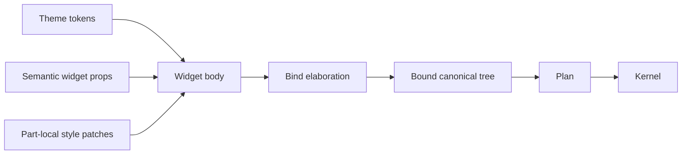
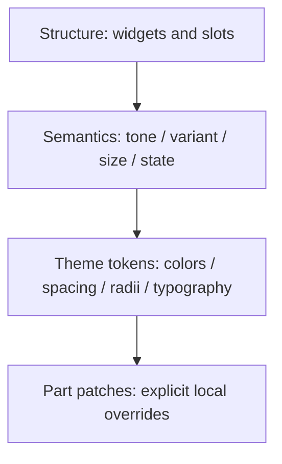
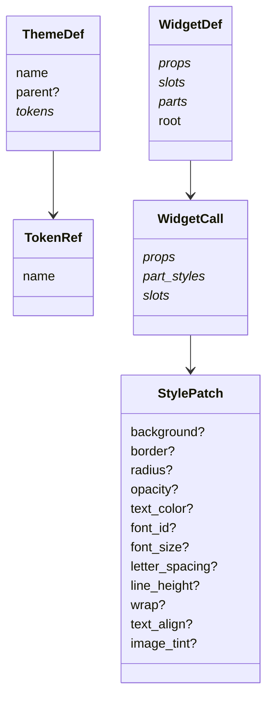
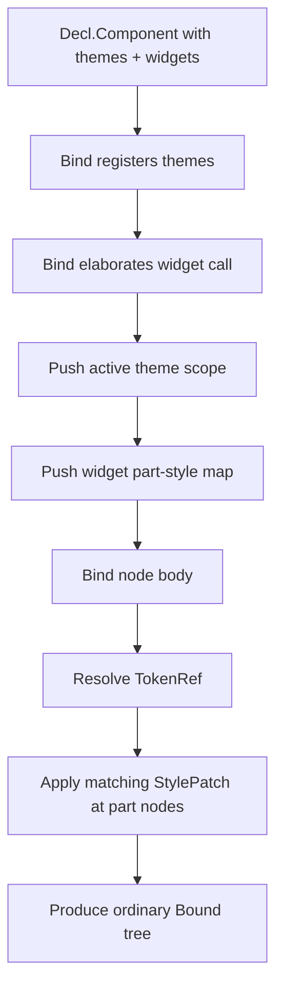

# TerraUI Widget Styling and Themes

Status: design-target v0.1  
Purpose: define the next Decl-layer authoring model for reusable styled widgets, theme tokens, and explicit part-level overrides.

Implementation note: this document is a **design target**, not a description of the currently shipped implementation. The current library has `ui.theme(...)` as thin sugar over env lookup and does not yet implement the full token/part/style model described here.

## 1. Problem statement

TerraUI already has:
- first-class authored widgets in `Decl`
- bind-time widget elaboration
- a canonical lower pipeline: `Decl -> Bound -> Plan -> Kernel`
- a working static-tree layout / input / paint kernel

The next layer of design is:

> how should users define reusable widgets with predefined visual styles and themeable defaults, while keeping the public model small, explicit, typed, and easy to lower away during bind?

The answer in this document is:
- use **semantic widget props** for intent
- use **typed theme tokens** for inherited values
- use **explicit named parts** for styling hooks
- use **style patches** for local presentational overrides
- keep all of this in `Decl`, and elaborate it away during bind

## 2. Design thesis

Themes should provide **values**.  
Widgets should provide **structure**.  
Style patches should provide **local presentational overrides**.

That yields the following separation:



## 3. Core principles

### 3.1 No selector engine

TerraUI should **not** adopt a CSS-like selector or cascade model.

No:
- tree-shape selectors
- widget-name selectors
- implicit descendant matching
- theme rules that target arbitrary internal widget nodes
- runtime style resolution by selector matching

Why:
- too implicit
- hard to type-check
- hard to validate
- hard to elaborate away honestly
- encourages styling by structure rather than semantics

### 3.2 Explicit semantic API over raw paint bags

Reusable widgets should expose semantic props like:
- `variant`
- `tone`
- `size`
- `selected`
- `disabled`

Those props express **meaning**, not raw visual values.

### 3.3 Explicit parts over structural reach-through

Widgets may expose styling hooks through **named parts**:
- `root`
- `label`
- `icon`
- `track`
- `thumb`

Part names are the only supported external styling surface for widget internals.

### 3.4 Style patches are presentational only

A style patch may change:
- box decor
- text styling
- image tint

A style patch may **not** change:
- child structure
- slots
- layout axis
- scrolling model
- floating model
- input policy

This preserves widget structure as the widget author’s responsibility.

### 3.5 Styled variants should usually just be widgets

`PrimaryButton`, `DangerButton`, `ToolbarButton`, and similar “predefined styles” should normally be authored as ordinary widgets composed from lower widgets.

That keeps the model unified:
- widgets are the reusable semantic unit
- styled variants are also widgets
- themes stay orthogonal

## 4. The public thinking model

TerraUI styling should be taught as a four-level stack:



More precisely:

1. **Structure**: widget composition and slots
2. **Semantics**: widget props such as `tone`, `variant`, `size`
3. **Theme tokens**: inherited typed values
4. **Part patches**: explicit call-site presentational overrides

## 5. First-class authored concepts

The design introduces four new authored concepts.

### 5.1 Tokens

A token is a typed named theme value.

Examples:
- `color.surface.panel`
- `color.text.primary`
- `color.button.accent.bg`
- `space.md`
- `radius.control`
- `font.body.size`

### 5.2 Theme definitions

A theme definition is a typed token map, optionally inheriting from another theme.

### 5.3 Theme scopes

A theme scope installs a theme lexically for a subtree, optionally with local token overrides.

### 5.4 Style patches

A style patch is a partial presentational override applied to a named widget part.

## 6. Authored model overview



## 7. Widget parts

### 7.1 Why parts exist

Parts solve the core “theme / predefined style” problem without leaking widget internals.

A widget body may internally contain many nodes, but external authors should not be able to style all of them arbitrarily. Instead, the widget exposes a deliberate contract.

Example exposed parts:
- button: `root`, `label`, `icon`
- scroll area: `viewport`, `vbar`, `vthumb`, `hbar`, `hthumb`
- card: `root`, `header`, `body`, `footer`

### 7.2 Part contract

A part is:
- named by the widget author
- validated during bind
- only meaningful inside one widget definition
- erased during bind after patch application

## 8. Theme token model

### 8.1 Theme tokens are typed

Each theme token declares:
- name
- value type
- value expression

This keeps theme data aligned with ASDL typing.

### 8.2 Theme scopes are lexical

Theme scopes apply to a subtree, not by selector matching.

That means:
- nested scopes override outer scopes
- the active theme environment is determined by tree nesting
- bind can model this with a stack

### 8.3 Themes provide values, not styling rules

A theme should not say:
- “all buttons have this background”
- “all labels inside cards should change to this font size”

A theme should instead say:
- `color.button.accent.bg = ...`
- `font.label.size = ...`
- `space.control.x = ...`

Widget authors map tokens to widget semantics.

## 9. Style patches

### 9.1 Scope of a style patch

A style patch applies to exactly one named part.

Example:

```lua
styles = {
    root = ui.style { background = ui.rgba(0.2, 0.4, 0.9, 1) },
    label = ui.style { text_color = ui.rgba(1, 1, 1, 1) },
}
```

### 9.2 Allowed patch surface

The initial patch surface should include:
- `background`
- `border`
- `radius`
- `opacity`
- `text_color`
- `font_id`
- `font_size`
- `letter_spacing`
- `line_height`
- `wrap`
- `text_align`
- `image_tint`

### 9.3 Deliberately excluded surface

The initial patch surface should exclude:
- structural children
- slot contents
- layout axis / child topology
- input policy
- scroll behavior
- floating behavior
- custom payload mutation

## 10. Merge model

Merge order must be explicit.

### 10.1 Token resolution order

For `TokenRef(name)`:

1. nearest active theme-scope override
2. nearest active named theme
3. theme inheritance chain
4. failure, or explicit env-backed fallback if the implementation still carries one

### 10.2 Part style merge order

For a part-tagged node during widget elaboration:

1. widget-authored node fields
2. token resolution inside those fields
3. matching widget-call style patch for that part
4. any more-local explicit authored values on the node that are defined after patch application semantics

The important rule is:

> themes provide values, part patches override presentation, and widget structure remains owned by the widget.

## 11. Bind-time elaboration model

Everything in this styling system should elaborate away during bind.



By the end of bind:
- no theme definitions survive
- no theme scopes survive
- no part names survive
- no style patches survive
- no token refs survive

Only canonical lowerable values remain.

## 12. Recommended Decl-level user surface

### 12.1 Theme authoring

```lua
ui.theme_def("base") {
    tokens = {
        ui.theme_token("color.surface.panel", ui.types.color, ui.rgba(0.10, 0.11, 0.13, 1)),
        ui.theme_token("color.text.primary", ui.types.color, ui.rgba(0.92, 0.94, 0.97, 1)),
        ui.theme_token("space.md", ui.types.number, 12),
        ui.theme_token("radius.control", ui.types.number, 8),
    }
}
```

### 12.2 Theme scope

```lua
ui.with_theme("dark") {
    ...
}
```

### 12.3 Token lookup

```lua
ui.token("color.surface.panel")
ui.token.color("color.text.primary")
ui.token.number("space.md")
```

### 12.4 Widget parts

```lua
ui.widget_part("root")
ui.widget_part("label")
ui.part("root", ui.row { ... } { ... })
```

### 12.5 Style patch

```lua
ui.style {
    background = ui.rgba(...),
    border = ui.border { ... },
    text_color = ui.rgba(...),
}
```

## 13. Example: base button + variant + local override

```lua
local Button = ui.widget("Button") {
    props = {
        ui.widget_prop("text")    { type = ui.types.string },
        ui.widget_prop("tone")    { type = ui.types.string, default = "neutral" },
        ui.widget_prop("variant") { type = ui.types.string, default = "solid" },
        ui.widget_prop("action")  { type = ui.types.string },
    },

    parts = {
        ui.widget_part("root"),
        ui.widget_part("label"),
    },

    root = ui.part("root",
        ui.button {
            action = ui.prop_ref("action"),
            padding = ui.token.number("space.md"),
            radius = ui.radius(ui.token.number("radius.control")),
            background = ui.token.color("color.button.surface"),
        } {
            ui.part("label",
                ui.label {
                    text = ui.prop_ref("text"),
                    text_color = ui.token.color("color.button.fg"),
                })
        })
}

local PrimaryButton = ui.widget("PrimaryButton") {
    props = {
        ui.widget_prop("text")   { type = ui.types.string },
        ui.widget_prop("action") { type = ui.types.string },
    },

    root = ui.use(Button) {
        text = ui.prop_ref("text"),
        action = ui.prop_ref("action"),
        tone = "accent",
        variant = "solid",
    } {}
}

ui.with_theme("dark") {
    ui.use(PrimaryButton) {
        text = "Save",
        action = "save",
        styles = {
            root = ui.style {
                border = ui.border {
                    left = 1, top = 1, right = 1, bottom = 1,
                    between_children = 0,
                    color = ui.token.color("color.focus"),
                },
            },
        },
    } {}
}
```

## 14. Why this model fits TerraUI

This design matches TerraUI’s existing strengths.

### 14.1 Decl stays rich

The authoring layer may hold:
- theme defs
- token refs
- widget parts
- style patches

### 14.2 Lower layers stay canonical

`Bound`, `Plan`, and `Kernel` do **not** need to know about:
- selectors
- cascades
- widget style matching systems
- part contracts
- theme registries

### 14.3 Bind remains the semantic elaboration phase

This is exactly the right place for:
- token resolution
- part-style merge
- widget-part validation
- theme-scope stack management

## 15. Non-goals for this design step

This document does **not** yet commit TerraUI to:
- gradients as first-class style values
- shadows / blur / filters
- animation / transitions
- CSS-like pseudostates
- dynamic runtime style recomputation systems
- generic paint programs

Those belong in the painting model and later backend work, not in the minimal widget/theming abstraction.

## 16. Design conclusion

The recommended model is:

> semantic widget props + typed theme tokens + explicit widget parts + part-local style patches, all elaborated away during bind.

This is the smallest API surface that is still powerful, explicit, typed, and architecturally honest for TerraUI.
