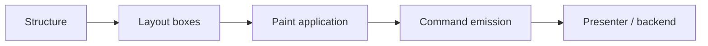
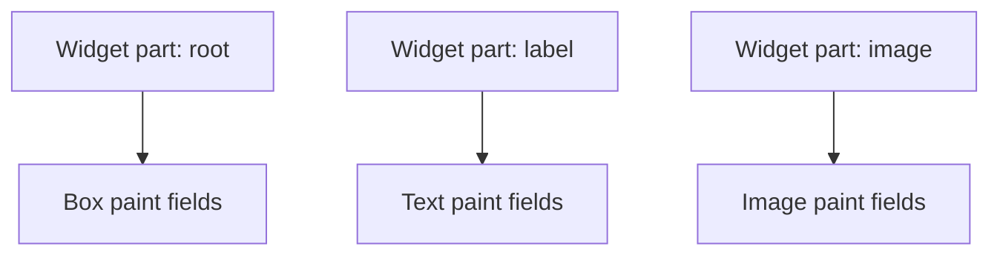
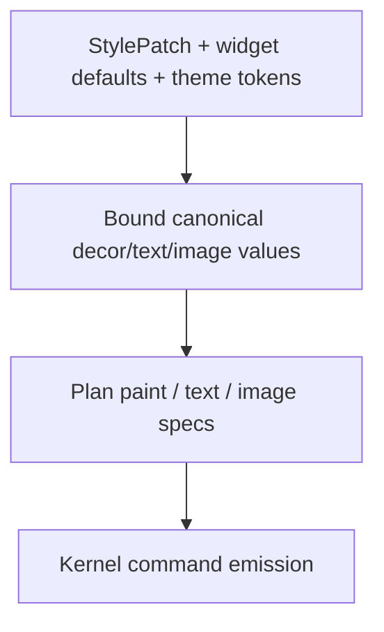
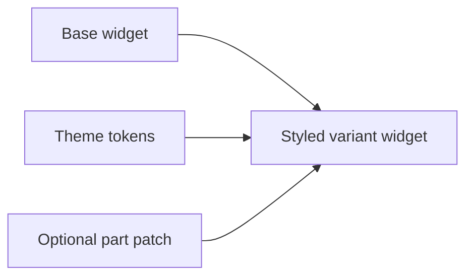

# TerraUI Painting Model

Status: design-target v0.1  
Purpose: define how TerraUI should think about presentation, paint roles, and style-patch scope on top of the widget/theming design.

Implementation note: this is a forward-looking design doc. The current implementation still uses the existing `Decor`, text style, image tint, and command-stream model without the full token/part/style system described here.

## 1. Why a separate painting document exists

Widget composition and theming answer:
- how users define reusable styled widgets
- how themes provide inherited values
- how call sites override exposed parts

But they do not fully answer:
- what counts as **paint** versus **structure**
- which properties are legal in a style patch
- how paint should map onto lower rendering commands
- how future paint richness should extend the model without breaking it

This document defines that boundary.

## 2. The main separation

TerraUI should keep a strong distinction between:

- **structure**: layout, composition, slots, scrolling, floating, input
- **paint**: visual presentation of already-decided boxes and leaves



This means:
- structure determines *where* something exists and how it behaves
- paint determines *how it looks*

## 3. What counts as paint in TerraUI

For the next design step, the canonical paint surface is:

### 3.1 Box paint
- background
- border
- corner radius
- opacity

### 3.2 Text paint
- text color
- font id
- font size
- letter spacing
- line height
- wrap mode
- text alignment

### 3.3 Image paint
- tint
- fit mode stays a layout/content rule, not a theme token by default

### 3.4 Custom paint
- custom leaves remain backend/product-specific
- their payloads are not part of the generic style-patch system yet

## 4. Paint is applied to parts, not arbitrary descendants

The painting model should compose with widget parts.

A style patch applies to a named part and only influences the paint-capable fields on that part’s node or leaf.



That means the external styling surface is still:
- explicit
- typed
- validated
- local

## 5. Style patches are not mini-widgets

A style patch should not become a second authoring language for nodes.

It is **not** allowed to:
- insert children
- change axis
- change scroll settings
- attach floating behavior
- alter input policy
- mutate slots

It is allowed only to replace or provide paint values.

## 6. Paint categories and intended future growth

The design should support growth, but in layers.

### 6.1 Stable v1 paint categories

These should be the first canonical patch categories:
- box decor
- text styling
- image tint

### 6.2 Future paint categories

Possible future extensions include:
- gradients
- shadows
- strokes beyond simple borders
- elevation presets
- blend modes
- shape fills beyond rectangular boxes

These should extend the paint model by adding more paint fields or paint records, **not** by changing the theme/part/patch mental model.

## 7. Painting should remain lower-layer friendly

The current lower pipeline already has a strong command model:
- rect commands
- border commands
- text commands
- image commands
- custom commands
- scissor commands

The painting design should continue to map cleanly onto that lower layer.



This is why the paint model should stay declarative and typed, rather than turning into an arbitrary runtime callback system.

## 8. Boundaries between paint and layout

Some fields look visual but still affect layout.

### 8.1 Clear paint fields
- background
- border color
- radius
- opacity
- text color
- image tint

### 8.2 Paint fields that also influence layout
- font size
- line height
- letter spacing
- wrap
- text align (only for emission placement, not intrinsic width itself in all backends)

These are still allowed in style patches, but the design must acknowledge that they can change intrinsic text measurement.

That is acceptable because:
- style patches elaborate during bind
- lower phases already handle text measurement as part of layout

### 8.3 Not paint
- axis
- padding
- gap
- width/height rules
- scrolling
- floating
- input

Those remain structural.

## 9. Paint roles versus raw tokens

Theme tokens should remain value-oriented, but TerraUI should leave room for **semantic paint roles** layered on top.

Examples:
- `color.button.accent.bg`
- `color.surface.panel`
- `color.text.muted`
- `color.focus.ring`

This keeps theme vocabulary semantic without introducing a selector engine.

The theme system does not need to know what a button is. It only provides named values. Widget authors decide how those values map to parts and semantics.

## 10. Focus rings and other overlays

Some future paint features, like focus rings or hover outlines, do not fit neatly into static box decor.

The recommended model is:
- keep the semantic notion at the widget/input layer
- lower it into ordinary paint commands during compilation or emission planning

That means focus rings should eventually be treated as:
- either an extended paint capability on the node
- or an extra command emission rule attached to interaction state

They still should **not** require a selector-based theme system.

## 11. Rounding and raster alignment

The painting model should cooperate with the existing layout model’s float-space semantics.

Recommended principle:
- layout remains float-based
- paint snaps only at the backend/raster boundary as needed
- scissor, rect, border, and text may each use slightly different snapping rules

This means theming and style patches should not try to encode raster snapping policy directly.

Raster snapping is a backend/presenter concern, not a theme concern.

## 12. Text paint and backend ownership

Text remains the most complicated visual primitive because it spans:
- theme/style values
- layout measurement
- backend shaping/rasterization

The clean split remains:
- TerraUI owns text layout semantics: wrap, align, height-for-width, font-related authored values
- backends own exact glyph metrics, shaping, caches, and raster resources

So text-related style patch fields should remain authored as ordinary declarative values and lower into the existing text backend contract.

## 13. Image paint

For images, the minimal theme/style surface should remain narrow:
- image id itself is content, not theme paint
- tint is paint
- fit is a content/layout rule

This avoids turning themes into content-selection systems.

## 14. Custom paint

Custom leaves already exist as a deliberate escape hatch.

The theming/painting design should not attempt to standardize arbitrary custom payload styling immediately.

Instead:
- custom leaves keep their own payload contract
- widgets may still use theme tokens to build those payloads if desired
- generic part style patches do not mutate custom payloads yet

## 15. Recommended initial `StylePatch` surface

The canonical initial `StylePatch` should include:

```text
background?
border?
radius?
opacity?
text_color?
font_id?
font_size?
letter_spacing?
line_height?
wrap?
text_align?
image_tint?
```

That gives enough expressive power for:
- themed buttons
- cards
- labels
- inspectors
- scrollbars
- toolbars

without widening the model too early.

## 16. Painting and predefined widget variants

Predefined variants like `PrimaryButton` should mostly be authored by composition, not by giant style objects.

Why:
- composition expresses semantic intent better
- style patches are best as local escape hatches
- widgets stay the main abstraction

So the intended layering is:



## 17. Validation implications

The paint model implies several validation rules:
- style patch fields must be type-correct
- a style patch may only target declared widget parts
- style patch fields may not target structural-only properties
- token values used for paint must bind to compatible types
- text style fields that affect measurement must still satisfy text validation rules

## 18. Design conclusion

The recommended paint model is:

> paint is the typed visual layer applied to already-authored structure, and style patches should remain narrow, explicit, part-local, and lowerable into the existing command model.

This keeps TerraUI’s painting story compatible with:
- authored widgets
- typed theme tokens
- bind-time elaboration
- canonical lower phases
- backend/session separation
